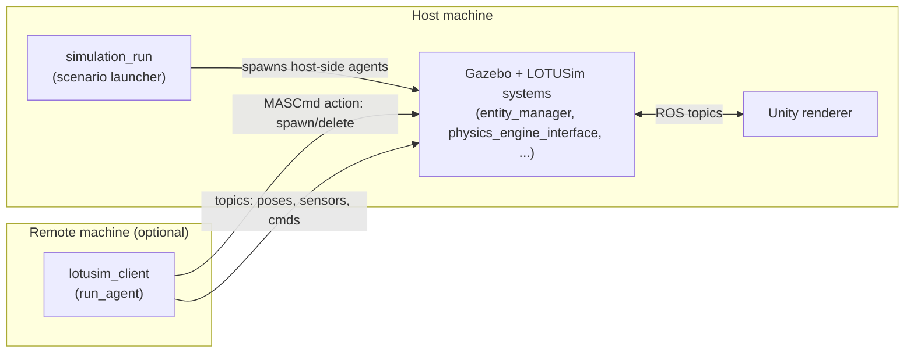
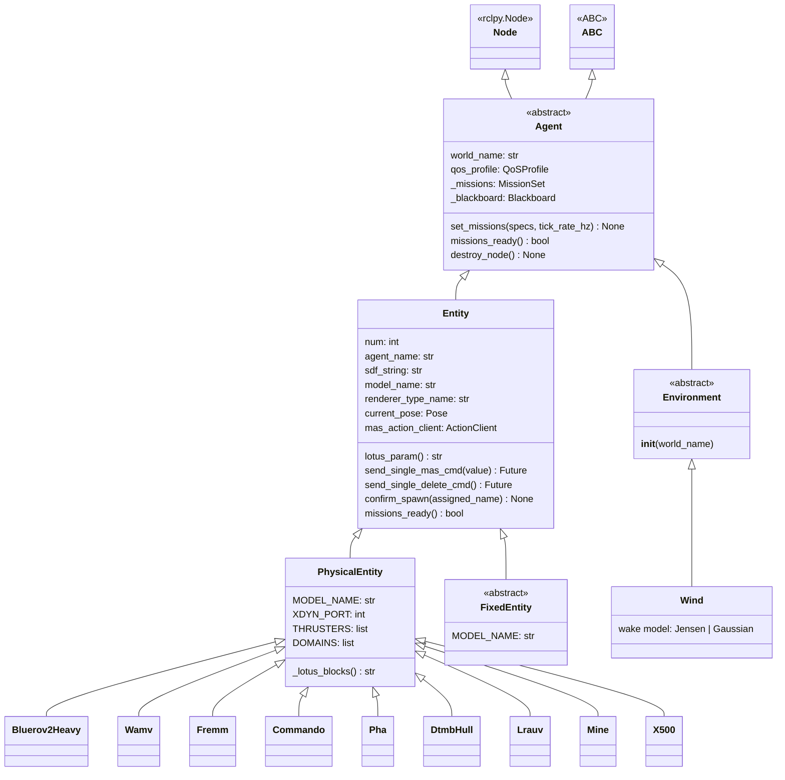
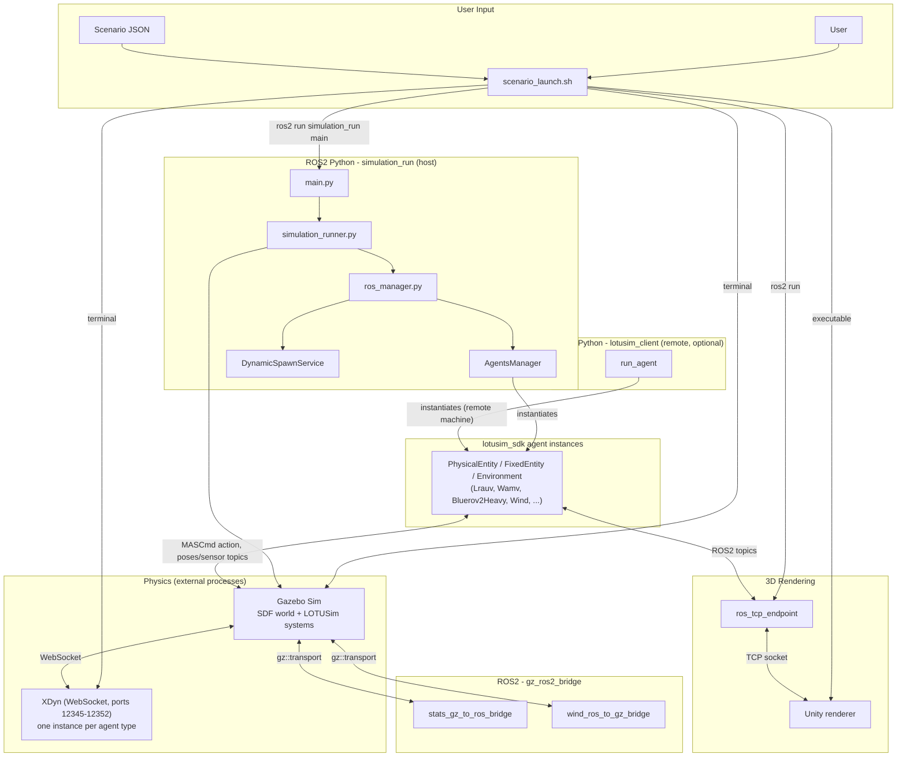

# Architecture

How the repository is organised: the two machines involved, the package tree,
the agent class hierarchy, and the orchestration flow that gets a scenario
from a JSON file to spawned agents in Gazebo.

> Scope note: this document covers **repository / code organisation only**.
---

## 1. Host vs. remote machines

LOTUSim runs across up to two machines on the same LAN, sharing one
`ROS_DOMAIN_ID` and talking only over ROS 2 / DDS.



- **Host**: runs Gazebo, the LOTUSim systems, the Unity renderer, and launches
  scenarios from `src/simulation_run/config/*.json` via `simulation_run`.
  Built with `lotusim clean_build`
- **Remote**: runs only `lotusim_client.run_agent` — no Gazebo. It spawns an
  agent into the host's simulation over ROS 2 and ticks that agent's BT
  mission locally. Needs only ROS 2, Python, and the `deployment/` bundle
  (§6).
- **Key principle**: the same agent class + same mission JSON runs
  identically whichever machine launches it — only the Python process's
  location differs.

---

## 2. Package tree (`src/`)

| Package | Role |
|---|---|
| `lotusim_sdk` | **The SDK.** Agent class hierarchy, the BT engine, built-in tasks. Ships as a wheel; used identically host- and remote-side. |
| `lotusim_client` | **Remote launcher.** `run_agent` CLI: instantiates an agent from a JSON config and ticks it against a running host simulation. Ships as a wheel. |
| `simulation_run` | **Host orchestrator.** Launches Gazebo/Unity, parses scenario JSON, spawns the full agent set, dynamic spawn/despawn service. ROS 2 `ament_python` package, host-only. |
| `external_packages/*` | **Concrete agent packages** — one per vehicle/demo (`bluerov2_heavy_inspection`, `wamv_inspection`, `x500_inspection`, `lrauv_propeller`, `custom_task_demo`). Each is a standalone ROS 2 package discovered via entry points (§3, §4). |
| `gz_ros2_bridge` | C++ package: two standalone bridge executables between `gz-transport` and ROS 2 (§7). |
| `deployment/` | The remote colcon workspace bundle: build script, `lotusim_msgs` source, wheels output (§6). |

### `lotusim_sdk/lotusim_sdk/`

```txt
lotusim_sdk/
├── agents/
│   ├── agent.py                 # Agent: rclpy.Node + BT mission engine (root abstract class)
│   ├── entity/
│   │   ├── __init__.py          # Entity: SDF model, pose tracking, MAS spawn/delete, sensor discovery
│   │   ├── physical/            # One file per concrete vehicle (bluerov2_heavy.py, wamv.py, x500.py, ...)
│   │   └── fixed/                # FixedEntity: static infrastructure, no physics engine
│   ├── physical_entity.py       # PhysicalEntity: XDyn / physics_engine_interface wiring
│   ├── fixed_entity.py
│   └── environment/
│       └── wind/                 # Wind: Environment agent modelling wake effects + LCOE (§8)
├── bt/                            # Behaviour Tree engine: Status, BehaviorNode, Sequence, Parallel,
│                                   # Blackboard, build_tree, load_task_registry
├── tasks/                         # Built-in TaskAgent leaves: fault_inspection, check_battery_state,
│                                   # waypoint_follower (+ fault_inspection_assets/ model + YOLO server)
├── spawn_utils.py                 # Shared host/remote helpers: pull a spawn pose out of a mission's
│                                   # waypoint_follower task when no explicit pose is given
└── trajectory_providers.py        # TrajectoryProvider ABC + PatrolFileProvider / WaypointListProvider
```

### `simulation_run/simulation_run/`

```txt
simulation_run/
├── main.py                # Entry point (`ros2 run simulation_run main --config ...`)
├── simulation_runner.py   # Full lifecycle: rclpy/executor init, launches Gazebo, hands off, cleans up
├── ros_manager.py         # Builds the AgentsManager, registers the DynamicSpawnService, runs the spin loop
├── agents_manager.py      # AgentsManager: JSON -> agent classes -> instances -> spawn queue -> MASCmd
├── utils.py                # CLI args, JSON/SDF parsing, class discovery, random pose generation
├── configs.py              # Re-exports WaypointFollowerConfig from the SDK
└── dynamic_spawn/          # Runtime spawn/despawn of agents into an already-running sim (§5)
```

### `external_packages/*`

Every package follows the same **thin subclass** shape — a base vehicle class
plus a `renderer_type_name`, with all behaviour coming from the mission JSON:

```txt
external_packages/
├── bluerov2_heavy_inspection/   # Bluerov2Heavy, thin
├── wamv_inspection/             # Wamv, thin
├── x500_inspection/             # X500, thin (also clears `domains` to skip aerialWorld physics)
├── lrauv_propeller/              # Lrauv + standalone propeller RPM cycling logic (dev example, no BT)
└── custom_task_demo/             # Bluerov2Heavy + a custom TaskAgent wired in code via
                                   # self._missions.add_task(...) instead of scenario JSON
```

`lrauv_propeller` and `custom_task_demo` are intentionally **not** thin: they
show the two ways to extend an agent beyond "pure JSON mission" — raw
ROS pub/sub logic in the class itself, or a code-registered BT task.

---

## 3. Agent class hierarchy



### Concrete vehicle classes and their constants

| Class | `MODEL_NAME` | `XDYN_PORT` | `DOMAINS` |
|---|---|---|---|
| `Bluerov2Heavy` | `bluerov2_heavy` | 12347 | Underwater |
| `Lrauv` | `lrauv` | 12346 | Underwater |
| `Mine` | `mine` | 12350 | Underwater |
| `Fremm` | `fremm` | 12349 | Surface |
| `Commando` | `commando` | 12352 | Surface |
| `Wamv` | `wamv` | 12348 | Surface |
| `Pha` | `pha` | 12351 | Surface |
| `DtmbHull` | `dtmb_hull` | 12345 | Surface |
| `X500` | `x500` | `None` (native ROS 2, no XDyn) | Aerial |

Each concrete class declares **only these class-level constants** — no
`__init__` override. `PhysicalEntity.__init__` reads them and wires up XDyn
(or, for `Aerial`, the native ROS 2 physics connection); `Entity.__init__`
sets up the SDF string, pose tracking, and the shared MASCmd/discovery
infrastructure (§3.1); `Agent.__init__` starts the BT mission timer.

### 3.1 Per-process shared infrastructure (`agents/entity/__init__.py`)

To scale to large agent counts in one process, `Entity` does **not** give
each instance its own ActionClient, pose subscription, or discovery timer.
Instead, module-level registries share one of each per `world_name` across
every agent in the process:

- one `ActionClient` for `/{world}/mas_cmd`, so rclpy never cross-routes a
  goal/result meant for one agent to another,
- one subscription to `/{world}/poses`, parsed once per message into a
  `name -> pose` dict that each entity reads by `O(1)` lookup,
- one discovery timer per world that queries the ROS graph once a second and
  dispatches matching `/{world}/{agent}/...` topics to the owning entity.

This eliminates an `O(N²)` scaling bottleneck that previously starved the
process (including spawn confirmations) once agent counts got large.

### 3.2 Spawn confirmation

`Entity.missions_ready()` gates the agent's first mission tick on
`_spawn_confirmed and current_pose is not None`: the host is the single
authority on entity names (it deconflicts duplicates across machines), so an
agent only starts ticking its mission once it has adopted the host-assigned
name (`confirm_spawn`) and has seen its own pose on `/{world}/poses` under
that name.

---

## 4. Task and agent discovery (entry points)

Both agent classes and BT task classes are discovered **across every
installed wheel** via setuptools entry-point groups — there is no central
registry to edit when adding a new package.

| Entry-point group | Declared in | Consumed by |
|---|---|---|
| `lotusim.agents` | each package's `setup.py` (e.g. `lotusim_sdk`, `bluerov2_heavy_inspection`, `custom_task_demo`) | `simulation_run.utils.find_agent_class_globally()`, `lotusim_client.run_agent._find_agent_class()` |
| `lotusim.tasks` | `lotusim_sdk` (built-ins: `fault_inspection`, `check_battery_state`, `waypoint_follower`) + any package defining its own `TaskAgent` | `lotusim_sdk.bt.builder.load_task_registry()` |

A new vehicle or task added in its own wheel is found automatically by both
the host launcher and the remote `run_agent` — neither needs to import it.

---

## 5. Host orchestration flow (`simulation_run`)

```mermaid
sequenceDiagram
    actor User
    participant Shell as scenario_launch.sh
    participant Main as main.py
    participant Utils as utils.py
    participant SimRunner as simulation_runner.py
    participant Gazebo as Gazebo
    participant RosMgr as ros_manager.py
    participant AgentsMgr as AgentsManager
    participant DynSpawn as DynamicSpawnService
    participant Agent as Agent instances

    User->>Shell: ./scenario_launch.sh --config my_scenario.json
    Shell->>Main: ros2 run simulation_run main --config ...

    Main->>Utils: load_config_from_json() / inject_first_ais_pose() / parse_simulation_config()
    Utils-->>Main: world_file, agents, aerial_enabled
    Main->>SimRunner: run_simulation(world_file, agents, ...)

    SimRunner->>SimRunner: rclpy.init(); MultiThreadedExecutor()
    SimRunner->>SimRunner: reset_gazebo_state()
    SimRunner->>Gazebo: terminal -> lotusim run *.world
    SimRunner->>RosMgr: initialize_ros_components(executor, agents, world_name, ...)

    RosMgr->>AgentsMgr: AgentsManager(); add_agents(agents, ...)
    RosMgr->>DynSpawn: create + executor.add_node() (subscribes /spawn_cmd, /despawn_cmd)

    loop for each agent type/instance
        AgentsMgr->>Utils: json_name_to_class_name() / find_agent_class_globally()
        AgentsMgr->>Agent: instantiate; set_missions() if JSON has "missions"
        AgentsMgr->>AgentsMgr: executor.add_node(agent); queue for spawn
    end
    AgentsMgr->>Agent: send_single_mas_cmd(pose) for every queued agent
    Agent->>Gazebo: MASCmd action (CREATE_CMD) with lotus_param() SDF blocks

    RosMgr-->>SimRunner: return agents_manager
    SimRunner->>RosMgr: run_executor(executor)
    Note over RosMgr: executor.spin_once(0.1s) loop, ticking every Agent's BT mission timer

    User->>Shell: Ctrl+C
    SimRunner->>AgentsMgr: delete_agents() (DELETE_CMD + destroy_node() per agent)
    SimRunner->>SimRunner: kill Gazebo/terminal/bridge processes, executor.shutdown(), rclpy.shutdown()
```

The **remote** side (`lotusim_client.run_agent`) runs the equivalent of the
inner loop only: it resolves agent classes the same way, calls
`set_missions()`, spawns via the same `send_single_mas_cmd`/MASCmd action
against the host's Gazebo, spins its own `MultiThreadedExecutor`, and on
SIGINT/SIGTERM halts BT roots and sends `send_single_delete_cmd()` before
shutting down.

---

## 6. Global architecture (all processes)



---

## 7. `gz_ros2_bridge` (C++)

Two standalone executables (no shared library), each linking
`gz-transport`/`gz-msgs` and `rclcpp`/`lotusim_msgs`:

| Node | Direction | Purpose |
|---|---|---|
| `stats_gz_to_ros_bridge` | Gazebo → ROS 2 | Publishes sim time / Real-Time Factor as `lotusim_msgs/SimStats`. |
| `wind_ros_to_gz_bridge` | ROS 2 → Gazebo | Injects wind commands from ROS 2 into `gz::transport`. |

`launch/bridge_nodes.launch.py` kills any previous instances of both, then
launches them together after a short delay.

---

## 8. Dynamic spawn subsystem (`simulation_run/dynamic_spawn/`)

Lets you spawn or remove agents from an **already-running** simulation,
independent of the scenario that was initially launched.

- `service.py` — `DynamicSpawnService` node: subscribes `/spawn_cmd` (JSON
  `{"AgentType": {...}}`) and `/despawn_cmd` (agent name), publishes status
  on `/spawn_status`, and exposes a `/list_agents` (`std_srvs/Trigger`)
  service. Delegates to `AgentsManager.spawn_one_agent()` /
  `despawn_agent()`.
- `spawn_agent.py`, `despawn_agent.py`, `list_agents.py` — thin CLI wrappers
  (`ros2 run simulation_run spawn_agent ...`) around the same topics/service.

---

## 9. `Wind` (`agents/environment/wind/`)

An `Environment` agent (no SDF model, no MAS spawn) that models turbine wake
effects and publishes derived data:

- `wake_model_base.py` — `WakeModelBase`, holding turbine parameters
  (diameter, thrust/power coefficients, cut-in/cut-out speed) with abstract
  `power()` / `wind_speeds_full()`.
- `jensen.py` / `gaussian.py` — two concrete wake models.
- `wind.py` — the `Wind` node: subscribes `/aerialWorld/wind`, publishes
  per-turbine data on `/{world}/wind/turbines`, and — if the scenario JSON's
  `wind` block has an `lcoe` section — discovers any spawned agent's
  `*/battery/state` topic to compute and publish an LCOE (€/MWh) estimate on
  `/{world}/lcoe`.

---

## 10. The deployment bundle (`deployment/`)

`deployment/` **is** the remote colcon workspace:

```txt
deployment/
├── build_wheels.sh      # Builds dist/lotusim_sdk-*.whl and dist/lotusim_client-*.whl (host-side)
├── dist/                 # Wheel output
├── src/
│   ├── lotusim_msgs/     # Shipped as SOURCE — compiled rosidl typesupport is tied to the exact
│   │                     #   ROS distro + CPython version, so it's rebuilt on the remote
│   └── example_agent/    # Reference template package for a new remote agent
├── my_config.json        # Example remote scenario config
└── README.md
```

Full instructions: [`deployment/README.md`](../deployment/README.md); the
wheel/source split rationale is in the root
