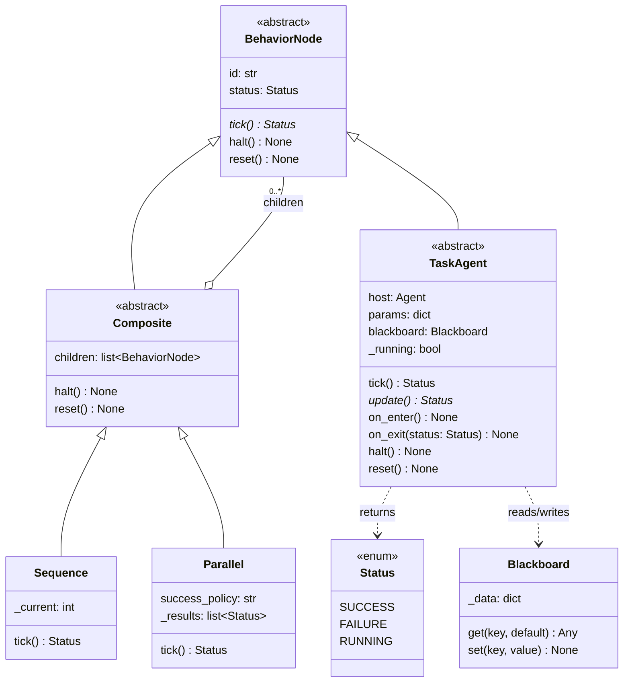
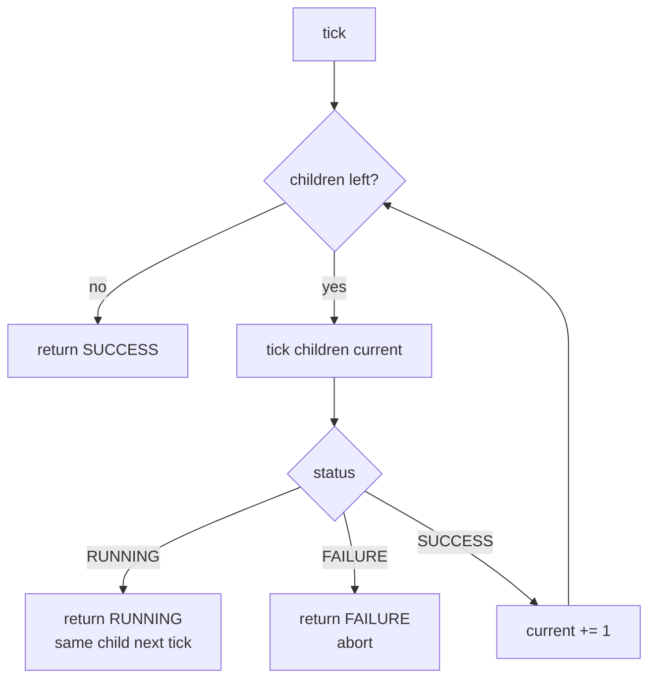
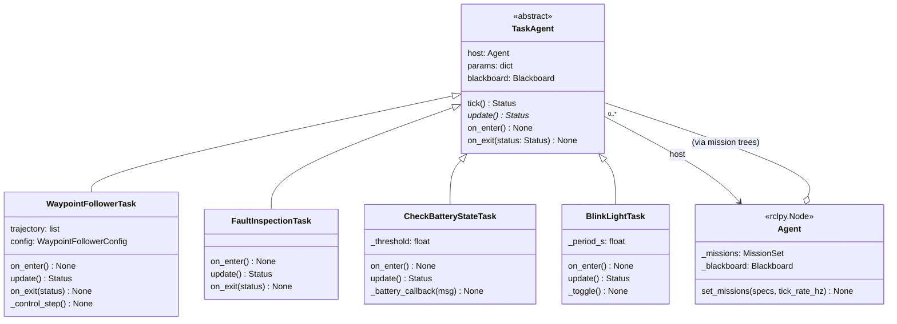
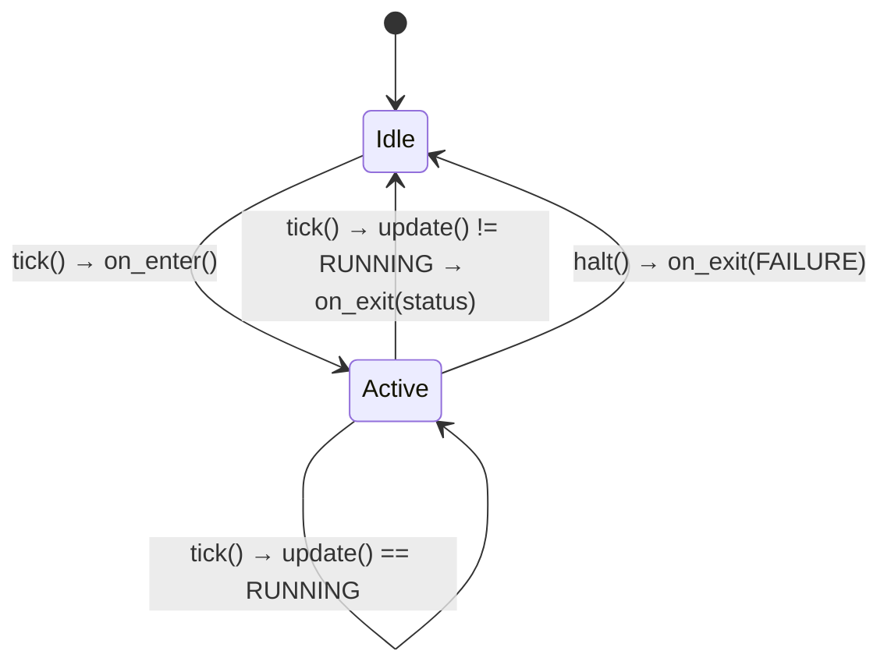
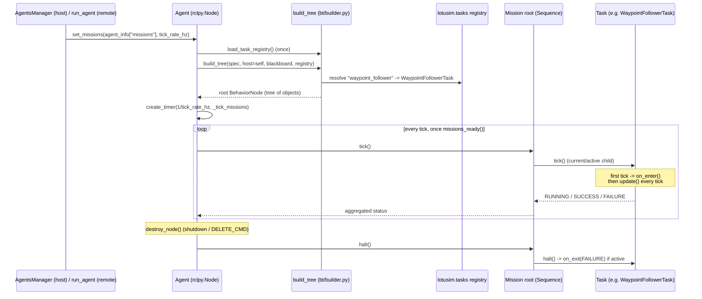
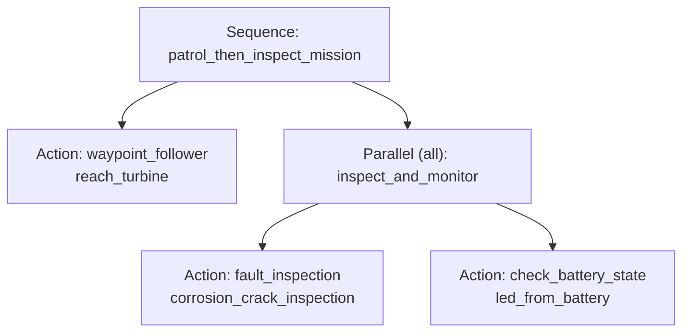

# Missions — the Behaviour Tree framework

How agent behaviour is defined and executed: the generic Behaviour Tree (BT)
engine that ships in `lotusim_sdk`, the `TaskAgent` leaf layer that bridges it
to ROS, the built-in tasks, and how a JSON mission spec becomes a running
tree ticked on an agent.

> Scope note: this document covers **the BT framework itself** — engine,
> lifecycle, built-in tasks, extension points. For the full JSON schema and a
> parameter-by-parameter scenario-writing guide (host vs. remote), see the
> planned `WRITE_SCENARIO.md`. For repository/package layout, see
> [`ARCHITECTURE.md`](ARCHITECTURE.md).

---

## 1. Why a Behaviour Tree

Every `Agent` (`lotusim_sdk/agents/agent.py`) is otherwise a bare `rclpy.Node`
— it has no built-in notion of "go here, then do that". Rather than hard-code
behaviour per vehicle class, LOTUSim drives every agent from a **mission**: a
small tree of nodes, described in the scenario JSON (or built directly in
Python), ticked at a fixed rate for the agent's whole lifetime. The agent
class itself stays thin (`renderer_type_name` and nothing else, see
[`ARCHITECTURE.md §2`](ARCHITECTURE.md#2-package-tree-src)); all behaviour —
patrol, inspect, monitor a sensor, blink a light — is data (JSON) or a small
reusable Python class (a `TaskAgent`), never a new agent subclass.

A Behaviour Tree was chosen over a hand-rolled state machine or a linear
task list because it composes: sequential ("patrol, *then* inspect"),
concurrent ("inspect *while* watching the battery"), and later reactive
("abort if battery critical") behaviours are all expressed with the same
handful of node types, nested arbitrarily, without an explosion of ad-hoc
transition logic. This mirrors the standard robotics rationale for BTs over
FSMs — modularity, reactivity, and reusability of subtrees — laid out in:

- M. Colledanchise & P. Ögren, *Behavior Trees in Robotics and AI: An
  Introduction*, CRC Press, 2018 — [arXiv:1709.00084](https://arxiv.org/abs/1709.00084)
  (the reference textbook; §2–3 formalize tick semantics and the
  Sequence/Fallback/Parallel/Decorator taxonomy this engine follows).
- M. Iovino et al., *A Survey of Behavior Trees in Robotics and AI*,
  Robotics and Autonomous Systems, 2022 — [arXiv:2005.05842](https://arxiv.org/abs/2005.05842)
  (surveys BT variants and applications; motivates why BTs generalize FSMs
  for modular, reactive robot control).
- Reference implementations that shaped this API:
  [BehaviorTree.CPP](https://www.behaviortree.dev) and
  [py_trees](https://py-trees.readthedocs.io) (the `Blackboard`
  async→sync-bridge pattern in §5 below follows `py_trees_ros`'
  `ToBlackboard` convention).

---

## 2. Where the pieces live

```txt
lotusim_sdk/lotusim_sdk/
├── bt/                     # Generic engine — no ROS, no LOTUSim specifics
│   ├── status.py           # Status: SUCCESS / FAILURE / RUNNING
│   ├── node.py             # BehaviorNode (ABC): tick() / halt() / reset()
│   ├── composites.py       # Composite (ABC), Sequence, Parallel
│   ├── blackboard.py       # Blackboard: shared key/value store
│   └── builder.py          # load_task_registry() + build_tree() — THE LINKER
├── tasks/                  # The Task LEAF layer — the ROS/LOTUSim bridge
│   ├── base.py             # TaskAgent (ABC): on_enter / update / on_exit
│   ├── waypoint_follower.py    # built-in: closed-loop guidance to a waypoint list
│   ├── fault_inspection.py     # built-in: camera + YOLO corrosion/crack detection
│   └── check_battery_state.py  # built-in: battery-driven status LED
└── agents/agent.py         # Agent: set_missions() + the tick timer (the "motor")
```

- **`bt/` is deliberately ROS-free.** It only knows `Status`, `BehaviorNode`,
  and the composites — it could be unit-tested or reused with no running ROS
  graph.
- **`tasks/base.py` is the bridge.** A `TaskAgent` leaf holds a reference to
  its `host` (the live `rclpy.Node`), so it depends on the agent layer. That
  split keeps the tree-walking logic testable in isolation from ROS/Gazebo.

A new task can live in **any** installed wheel — `external_packages/*` or a
user's own package — registered the exact same way as the three built-ins
(§4), discovered with zero edits to `lotusim_sdk` (§7).

---

## 3. The engine — core classes



### 3.1 `Status` — the tick's return value

Three values, per Colledanchise & Ögren §2.1: `SUCCESS`, `FAILURE`,
`RUNNING`. **`RUNNING` is the keystone.** It is what lets a node span several
ticks — without it you cannot express "do A *fully*, then B", nor run two
long-lived tasks side by side under a `Parallel`. Every `WaypointFollowerTask`
tick, for instance, returns `RUNNING` until the agent is within
`range_tolerance` of the final waypoint.

### 3.2 `BehaviorNode` — the universal plug

The abstract base of **everything** in the tree (`bt/node.py`). Its only
mandatory method is `tick()`. This common interface is what lets a parent
tick *any* child uniformly — a `Composite` stores
`children: list[BehaviorNode]` and calls `child.tick()` without caring
whether the child is another composite or a leaf task. That polymorphism is
the entire reason arbitrary nesting ("sequence inside parallel inside
sequence…") works with no special-casing anywhere in the engine.

`halt()` preempts a subtree (called on a child a parent is no longer
ticking); `reset()` rearms a subtree so it can run again from scratch. Both
default to no-ops on `BehaviorNode` and are overridden meaningfully by
`Composite` (recurse into children) and `TaskAgent` (§5).

### 3.3 `Composite`, `Sequence`, `Parallel`

`Composite` (`bt/composites.py`) is the abstract parent of every node that
holds several children and defines how control flows among them.

**`Sequence`** — ordered, logical AND, with **memory** semantics (it
remembers `_current`, the index of the child still running, so completed
children are never re-ticked):



**`Parallel`** — ticks **every non-terminal child, every tick** (a child that
already reached `SUCCESS`/`FAILURE` is remembered in `_results` and skipped):

- any child `FAILURE` → the whole node is `FAILURE`
- `success_policy="all"` (default): `SUCCESS` once every child has succeeded
- `success_policy="one"`: `SUCCESS` as soon as one child succeeds
- otherwise → `RUNNING`

> **Reactive vs. memory Sequence.** A *reactive* Sequence re-ticks from the
> first child every tick (continuously re-checking earlier guard
> conditions); a *memory* Sequence — what LOTUSim implements — resumes where
> it left off. The reactive variant becomes relevant once condition guards
> are added (§8); it is not needed for the composites available today.

`_COMPOSITES = {"sequence": Sequence, "parallel": Parallel}` in
`bt/builder.py` is the exhaustive map from a JSON `"type"` string to a
composite class — **`Fallback` (logical OR) is not implemented yet** (§8).

### 3.4 `Blackboard` — shared intra-agent state

A plain key/value store (`bt/blackboard.py`), one per agent, passed to every
node in its mission trees. It exists to let two tasks that don't know about
each other exchange state — e.g. a future crack-scanning task writing
detected poses that a repositioning task later reads.

**Why not just use ROS topics for this?** They operate at different layers,
and are complementary rather than competing:

> **ROS = *inter-agent* / *inter-process* communication (the agent's public
> interface). Blackboard = *intra-agent* / *intra-tree* state (the mission's
> internal memory).**

1. **Synchronous vs. asynchronous.** A tick must read a value *now*, inside
   the same call. ROS pub/sub is asynchronous — a callback fires *later*. So
   even with ROS you still need a place to hold the latest received value
   for the tick to read synchronously; that place is the blackboard. This is
   exactly the pattern `py_trees_ros`' `ToBlackboard` formalizes: a ROS
   callback writes the latest value in, a task's `update()` reads it back.
2. **Internal state that has no business on the network** — a retry
   counter, the current waypoint index, "the crack *this* agent is about to
   inspect" — stays local, in memory, at zero DDS/QoS/serialization cost.
3. **Arbitrary Python objects, no `.msg`.** A dict, a numpy array, a
   callable — defining a ROS message type for scratch data is overkill.

Rule of thumb: **data leaving the agent → ROS topic; state internal to the
mission → blackboard; ROS data consumed by a task → the ROS callback writes
it into the blackboard, the tick reads it from there.** None of the current
built-in tasks share data across siblings, so the blackboard is wired end to
end (every task receives it) but not yet exercised by any of them — the API
is stable and ready for the first task that needs it.

---

## 4. The Task leaf layer



### 4.1 `TaskAgent` — the leaf base (`tasks/base.py`)

A concrete task is `class MyTask(TaskAgent)` implementing **only**
`update()`. `tick()` is a non-overridable **template method** that drives a
per-*activation* lifecycle:

```python
def tick(self) -> Status:            # template — DO NOT override in tasks
    if not self._running:
        self.on_enter()
        self._running = True
    status = self.update()
    if status != Status.RUNNING:
        self.on_exit(status)
        self._running = False
    self.status = status
    return status
```



- **`on_enter()`** fires once each time the leaf transitions from idle to
  active — the place to create subscriptions/publishers/timers, or reset
  per-run state.
- **`update()`** is the one mandatory method — the work of a single tick.
- **`on_exit(status)`** fires when the leaf leaves the active state, whether
  by finishing (`SUCCESS`/`FAILURE`) or by being `halt()`ed by a parent that
  moved on — the place to tear down whatever `on_enter()` created.
- **`halt()`** forces `on_exit(FAILURE)` if the leaf is currently active,
  called by a composite (`Sequence`/`Parallel`) or `Agent.destroy_node()`
  when a subtree is preempted.

This on_enter/update/on_exit shape is deliberate: it is the same lifecycle
`TaskAgent`'s ancestor (the pre-BT `on_attach`/`on_detach` spawn-time
capability layer) used, but re-scoped to fire **per activation** instead of
once per spawn — a task can be entered, exited, and re-entered many times
across a mission's lifetime (e.g. a `waypoint_follower` inside a `Sequence`
that loops).

### 4.2 The built-in tasks

| Task name (`lotusim.tasks`) | Class | `update()` behaviour | Notes |
|---|---|---|---|
| `waypoint_follower` | `WaypointFollowerTask` | `RUNNING` until within `range_tolerance` of the last waypoint (`SUCCESS`); `FAILURE` if no waypoints resolved | Runs the guidance/control loop **on the agent node**, not in a Gazebo plugin — see §4.3. |
| `fault_inspection` | `FaultInspectionTask` | event-driven: always `RUNNING`, detections published as they arrive | HSV corrosion + YOLO crack inference on `/{world}/{agent}/inspection/image`. |
| `check_battery_state` | `CheckBatteryStateTask` | event-driven: always `RUNNING` | Subscribes `/{world}/{agent}/battery/state`, edge-triggers a `Bool` on `/{world}/{agent}/light/cmd` when the percentage crosses `threshold`. |

An **event-driven** task (`fault_inspection`, `check_battery_state`) does its
real work in a ROS callback set up in `on_enter()`, and simply reports
`RUNNING` from every `update()` — it is "alive" for as long as it stays in
the tree, not something that completes. A **goal-directed** task
(`waypoint_follower`) tracks its own progress and returns `SUCCESS`/`FAILURE`
so a `Sequence` can move on to the next phase.

### 4.3 Worked example — `WaypointFollowerTask`

Chosen as the deep-dive example because it demonstrates the framework's
host/remote symmetry end to end. Unlike the legacy spawn-time capability it
replaced (which delegated guidance to a Gazebo `WaypointFollower` plugin over
a ROS **service**), the closed-loop bang-bang/PID guidance now runs **inside
the task**, on whichever machine is ticking the mission:

1. `on_enter()` creates a publisher for `/{world}/vessel_cmd_array` and a
   dedicated high-rate control timer (`control_rate_hz`, default 20 Hz) on
   its own `MutuallyExclusiveCallbackGroup` — so guidance cannot be starved
   behind the agent's other 1 Hz housekeeping callbacks when several agents
   share one `MultiThreadedExecutor`.
2. Each control step reads `host.current_pose` (fed by the shared
   `/{world}/poses` subscription in `Entity`, see
   [`ARCHITECTURE.md §3.1`](ARCHITECTURE.md#31-per-process-shared-infrastructure-agentsentity__init__py)),
   computes a body-frame velocity set-point `{"u": m/s, "w": rad/s}`, and
   publishes it as a `VesselCmdArray`.
3. The task sets `host._kinematic_guidance = True` at construction, which
   `PhysicalEntity._lotus_blocks()` turns into a
   `<connection_type>Kinematic</connection_type>` block at spawn time,
   telling the host's Gazebo `KinematicInterface` plugin to integrate that
   velocity set-point using Gazebo's own simulation time step.
4. Because the agent only ever *publishes ROS topics* and *reads a pose
   topic*, the exact same task + mission JSON produces identical motion
   whichever machine (host or remote) is ticking it — there is no
   host/remote clock divergence, since integration always happens host-side
   in Gazebo's own clock.

### 4.4 Custom tasks and code-built missions (`custom_task_demo`)

A task does not need a scenario-JSON `missions` block at all —
`external_packages/custom_task_demo/custom_task_demo/agent.py` shows the
alternative: `BlinkLightTask(TaskAgent)` and `CustomTaskDemoAgent` live in the
**same file**, and the agent wires the task directly in code:

```python
class CustomTaskDemoAgent(Bluerov2Heavy):
    def __init__(self, sdf_string, world_name, xdyn_enabled, **kwargs):
        super().__init__(sdf_string, world_name, xdyn_enabled)
        blink = BlinkLightTask(host=self, params={"period_s": 0.5},
                                blackboard=self._blackboard, id="blink")
        self._missions.add_task(blink)   # code-built mission, no JSON "missions" needed
```

`self._missions` is a `MissionSet` (a `list` subclass, `agents/agent.py`)
whose `add_task()` appends a ready-built `BehaviorNode` root directly,
alongside any tree `set_missions()` later builds from JSON — the two
mechanisms coexist. `BlinkLightTask` is still registered under
`lotusim.tasks` (`blink_light`) in the package's own `setup.py`, so it also
remains usable from a scenario JSON on **any** agent, not just this one.
This is the template for "a user ships their own wheel with its own task and
possibly its own agent" — the same shape as `deployment/src/example_agent`.

---

## 5. The linker — registry + builder (`bt/builder.py`)

This is the code that turns a JSON mission spec into a live tree, run once
per agent (at `set_missions()` time).

### 5.1 Task discovery (`load_task_registry`)

```python
def load_task_registry() -> Dict[str, Type]:
    registry: Dict[str, Type] = {}
    for ep in entry_points(group="lotusim.tasks"):
        registry[ep.name] = ep.load()
    return registry
```

Mirrors agent discovery (`lotusim.agents`, see
[`ARCHITECTURE.md §4`](ARCHITECTURE.md#4-task-and-agent-discovery-entry-points)):
resolved across **every installed wheel**, so a task defined in a user's own
package appears in the registry automatically, with zero edits to
`lotusim_sdk`.

### 5.2 The recursive builder (`build_tree`)

```python
def build_tree(spec: dict, host, blackboard, registry) -> BehaviorNode:
    node_type = spec.get("type")
    if node_type in _COMPOSITES:                          # "sequence" | "parallel"
        children = [build_tree(c, host, blackboard, registry)
                    for c in spec.get("children", [])]
        kwargs = {"success_policy": spec.get("success_policy", "all")} \
            if node_type == "parallel" else {}
        return _COMPOSITES[node_type](id=spec.get("id", ""), children=children, **kwargs)
    task_cls = registry[spec["task"]]                      # KeyError -> clear "unknown task" error
    return task_cls(host=host, params=spec.get("params", {}),
                     blackboard=blackboard, id=spec.get("id", ""))
```

Every JSON node is one of two shapes:

| `type` | Builds | Notes |
|---|---|---|
| `sequence` | `Sequence` | children in order (AND) |
| `parallel` | `Parallel` | children at once; optional `success_policy` (`"all"` default, or `"one"`) |
| `action` / `condition` | the class named by `task`, resolved from the registry | leaf; `params` passed through verbatim |

`build_tree` is where every link is actually made: a composite receives its
already-built children (recursion happens depth-first, children before
parent), and a leaf is resolved through the registry and instantiated with
its own `params` plus the shared `host` and `blackboard`.

---

## 6. The runtime — `Agent.set_missions()` and the tick

The "motor" is a periodic `rclpy` timer on the agent itself
(`agents/agent.py`), the same `create_timer` mechanism agents already use
for everything else:

```python
def set_missions(self, specs, tick_rate_hz: float = DEFAULT_TICK_RATE_HZ) -> None:
    registry = load_task_registry()
    self._missions.extend(
        build_tree(spec, self, self._blackboard, registry) for spec in specs
    )
    self._tick_rate_hz = tick_rate_hz
    self._mission_timer.cancel()
    self._mission_timer = self.create_timer(1.0 / tick_rate_hz, self._tick_missions)

def _tick_missions(self) -> None:
    if not self._missions:
        return
    if not self._missions_started:
        if not self.missions_ready():      # gate: e.g. wait for spawn confirmation
            return
        self._missions_started = True
    for root in self._missions:
        root.tick()
```

- **Multiple entries in `missions: [...]` are independent tree roots, ticked
  together every timer period → they run in parallel.** To make phases run
  strictly one after another instead, nest them as children of **one**
  mission whose root is a `sequence` (exactly the `sequence_and_parallel`
  example in §6.2).
- `missions_ready()` is the gate on the very first tick. The base `Agent`
  is always ready; `Entity` (the base of every physical vehicle) overrides
  it to require `_spawn_confirmed and current_pose is not None` — so a
  mission never binds a task's ROS topics to an entity before the host has
  actually placed it in the world (see
  [`ARCHITECTURE.md §3.2`](ARCHITECTURE.md#32-spawn-confirmation)). This
  matters in particular for `waypoint_follower`, whose control loop needs a
  real first pose to compute against.
- `Agent.destroy_node()` cancels the mission timer and calls `halt()` on
  every root — which recurses through `Composite.halt()` into every active
  leaf's `on_exit(FAILURE)` — so teardown (e.g.
  `WaypointFollowerTask.on_exit` publishing a final stop command) always
  runs on shutdown or DELETE_CMD, not just on natural completion.
- Because `_missions` is a plain list (`MissionSet`, itself just a `list`
  subclass with an `add_task()` convenience method), a JSON-built tree
  (`set_missions`) and a code-built root (`self._missions.add_task(...)`,
  §4.4) coexist without either mechanism knowing about the other.

### 6.1 End-to-end sequence



### 6.2 Worked example — `sequence_and_parallel.json`

A `Bluerov2HeavyInspection` that reaches a turbine, then inspects it while
monitoring its battery **concurrently**:

```json
{
  "id": "patrol_then_inspect",
  "class": "Bluerov2_heavy_inspection",
  "tick_rate_hz": 2.0,
  "missions": [
    {
      "id": "patrol_then_inspect_mission",
      "type": "sequence",
      "children": [
        { "id": "reach_turbine", "type": "action", "task": "waypoint_follower",
          "params": { "loop": false, "guidance_mode": "bang_bang",
                      "waypoints": [ { "lat": 50.32950, "lon": -4.19400 } ] } },
        { "id": "inspect_and_monitor", "type": "parallel", "success_policy": "all",
          "children": [
            { "id": "corrosion_crack_inspection", "type": "action",
              "task": "fault_inspection", "params": { "show_window": true } },
            { "id": "led_from_battery", "type": "action",
              "task": "check_battery_state", "params": { "threshold": 80.0 } }
          ]
        }
      ]
    }
  ]
}
```



Ticked at 2 Hz: the root stays on `reach_turbine` (returning `RUNNING`) until
the BlueROV is within `range_tolerance` of the turbine, at which point it
returns `SUCCESS` and the `Sequence` advances to `inspect_and_monitor`. Both
of *its* children are event-driven (§4.2) and never terminate on their own —
this branch of the mission simply stays `RUNNING` forever once entered,
which is expected for a monitoring phase with no defined end.

---

## 7. Extending the framework

### 7.1 Adding a task — no core-repo edit required

1. Subclass `TaskAgent`, implement `update()` (and `on_enter`/`on_exit` if
   the task owns ROS resources).
2. Register it under `lotusim.tasks` in **your own package's** `setup.py`:

   ```python
   entry_points={
       "lotusim.tasks": [
           "my_task = my_package.my_task:MyTask",
       ],
   },
   ```

3. Reference it from any scenario JSON as `"task": "my_task"` — on any agent
   class, host-side or remote — or wire it in code via
   `self._missions.add_task(MyTask(host=self, ...))` in a custom agent's
   `__init__` (§4.4).

This is the same "PhD ships their own wheel" story as agent discovery
(`lotusim.agents`, [`ARCHITECTURE.md §4`](ARCHITECTURE.md#4-task-and-agent-discovery-entry-points)):
`load_task_registry()` resolves entry points across every installed
distribution, so nothing in `lotusim_sdk` needs to change.

### 7.2 Adding a composite type

Add the class to `bt/composites.py` (subclassing `Composite`) and add its
JSON `"type"` string to `_COMPOSITES` in `bt/builder.py`. This is the one
extension point that **does** require an SDK edit (composites are the
control-flow vocabulary of the JSON format, not a per-package plugin like
tasks) — see §8 for what's already planned here.

---

## 8. Deliberately out of scope (for now)

Per the BT literature's full node taxonomy (Colledanchise & Ögren, ch. 3–4),
the following are not implemented yet and are natural next steps rather than
gaps in the current design:

- **`Fallback`** (logical OR) — try alternatives in order, `SUCCESS` on the
  first that succeeds, `FAILURE` only if all fail. The natural home for
  "try approach A, else B" recovery branches.
- **Decorators** (`Retry`, `Timeout`, `Inverter`, `ForceSuccess`, `Guard`) —
  single-child nodes that wrap a subtree's result. A `retry_limit` field
  maps naturally to `Retry(max_attempts=...)`, `on_failure: "continue"` to
  `ForceSuccess`, and a guard condition to `Guard`.
- **A reactive `Sequence` variant** — re-checks earlier children's guard
  conditions every tick instead of resuming from `_current`; only useful
  once condition leaves / decorators exist to have something worth
  re-checking.
- **Real `Blackboard` usage** — the store is fully wired (every `TaskAgent`
  receives it) but no built-in task currently reads or writes it; the first
  task that needs cross-task state (e.g. a detection task sharing a pose
  with a repositioning task) is the natural point to start exercising it.
