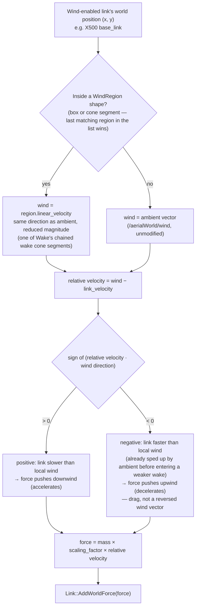
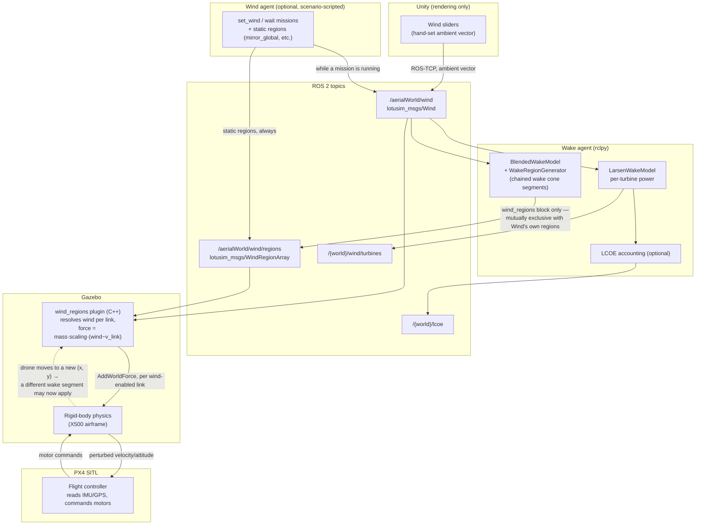

# Wake effect — forces and data flow

Companion to [`ARCHITECTURE.md` §9](ARCHITECTURE.md#9-wind-and-wake-agentsenvironment)
and the `wind_regions` section of [`WRITE_SCENARIO.md`](WRITE_SCENARIO.md).
Two diagrams: the force actually applied to a wind-enabled vehicle at a given
instant, and the full path a wind value takes from the Unity sliders to a
PX4-controlled drone crossing the wind farm.

---

## 1. Force diagram

Only one force formula exists in the system — `wind_regions_plugin.cpp`'s
`Update()` applies `force = mass × scaling_factor × (wind − link_velocity)` to
every wind-enabled link, every physics tick, whether that link is inside one
of `Wake`'s wake cone segments or out in the ambient wind. A wake segment
never reverses the wind vector (see the two published diagrams below) — the
force can still point upwind if the vehicle is already moving faster than the
locally reduced wind, which is a drag/deceleration effect, not a sign bug in
the segment:

The mass multiplication is stock `gz-sim-wind-effects-system`'s own
approximation, kept for physical/tuning consistency with the plugin it
replaces — it cancels mass out of the resulting acceleration, so a heavy
airframe doesn't visibly under-react compared to a light one.

---

## 2. Processing diagram — sliders to a PX4 drone crossing the farm

Two things this diagram makes explicit:

- **`Wake` is the only place the wind is interpreted twice**, for two
  different consumers: `LarsenWakeModel` turns it into turbine power and,
  optionally, LCOE (never touches a wind-enabled vehicle); `BlendedWakeModel`
  + `WakeRegionGenerator` turn the same ambient reading into the wake cone
  segments a vehicle actually flies through. Neither model knows about PX4 or
  the drone — they only ever produce ROS messages that Gazebo's plugin later
  resolves.
- **The physics/PX4 loop (dashed edge) is the only part that is per-tick.**
  Everything upstream of `/aerialWorld/wind/regions` only recomputes when the
  ambient wind itself changes enough (`wind_changed_enough`'s hysteresis) —
  the drone can cross many wake segments between two such recomputations,
  simply by moving through an already-published, static chain of segments.

---

## 3. The ROS messages, field by field

Both message types are defined in the core repo
(`LOTUSim/interfaces/lotusim_msgs/msg/`), not this one — this is what
actually goes on the wire between every party in the diagram above.

### `lotusim_msgs/Wind` — the ambient/global vector

| Field | Type | Meaning |
|---|---|---|
| `linear_velocity` | `geometry_msgs/Vector3` | Wind velocity in m/s, world ENU (`x`=East, `y`=North, `z`=Up). Only `x`/`y` are ever used — every consumer (`LarsenWakeModel`, `BlendedWakeModel`, `wind_regions_plugin`) works in the horizontal plane; `z` is carried but ignored. |
| `enable_wind` | `bool` | Whether the ambient vector is "on" at all. `false` means: `Wake._on_wind` ignores the message outright (no power/LCOE/region update — see `wake.py`'s early `return`); `wind_regions_plugin::ResolveWind` treats a link outside every region as feeling *nothing*, not zero wind — it simply applies no force that tick. |

Published on `/aerialWorld/wind` by whoever currently owns the topic — the
Unity sliders by default, or the `Wind` agent while one of its `missions` is
running (§5.3 of `WRITE_SCENARIO.md`). `Wake` and `wind_regions_plugin` both
subscribe to it directly; neither cares which of the two wrote it.

### `lotusim_msgs/WindRegionArray` — the whole region list, published atomically

A single field, `WindRegion[] regions`. There is no incremental update: every
publish replaces the *entire* list the plugin holds (latched, `TRANSIENT_LOCAL`,
depth 1) — this is why `Wind`'s static `regions` and `Wake`'s dynamic
`wind_regions` must not both be declared in one scenario (§5.3), and why
`Wind.destroy_node()` publishes an empty array on shutdown rather than leaving
the last one stuck on the (latched) topic.

### `lotusim_msgs/WindRegion` — one region

| Field | Type | Meaning |
|---|---|---|
| `id` | `string` | Label only — carried through for logs/telemetry and (SDK side) used as a stable per-slice key, e.g. `wake_wind_turbine_1_3`. Never read by `Contains()`. |
| `shape_type` | `uint8` (`BOX=0` / `CONE_SEGMENT=1`) | Discriminator: which of `box`/`cone` below actually holds this region's geometry. Named ROS msg constants, not meaningful numbers — see the class discussion above for why the plugin only branches on this once, in `MakeShape()`. |
| `box` | `WindRegionBox` | Valid iff `shape_type == BOX`. Always the shape for `Wind`'s static `regions` list. |
| `cone` | `WindRegionConeSegment` | Valid iff `shape_type == CONE_SEGMENT`. Always the shape for `Wake`'s dynamic `wind_regions` output. |
| `linear_velocity` | `geometry_msgs/Vector3` | The wind vector applied to a link *inside* this region — a full replacement of the ambient vector, not an offset added to it (see §1's `REGIONW` node). |
| `enable_wind` | `bool` | Per-region version of `Wind.enable_wind` above — `false` means a link inside this region feels no force at all, ambient included. Every region either agent publishes today always sets this `true`; the field exists so a region could explicitly kill wind in a pocket of the world if a future scenario needs one. |

### `lotusim_msgs/WindRegionBox` — the box shape

| Field | Type | Meaning |
|---|---|---|
| `x1`, `y1`, `x2`, `y2` | `float64` | Box corners in world ENU X/Y, **all altitudes** — there is no `z` bound, matching the ambient wind, which has none either. `Contains(x, y)` is a plain axis-aligned bounds check. |

### `lotusim_msgs/WindRegionConeSegment` — the cone-segment shape

| Field | Type | Meaning |
|---|---|---|
| `origin` | `geometry_msgs/Point` | World ENU (`x`, `y`) where this segment starts, i.e. the position `origin + x_start * unit_wind` for the turbine and downstream slice it came from (`z` unused). |
| `axis` | `geometry_msgs/Vector3` | Unit downstream direction (`x`, `y` — same as the wind direction the segment was generated for; `z` unused). `Contains()` projects a candidate point onto this axis to get its downstream distance `d`. |
| `length` | `float64` | How far this one segment extends along `axis`, in metres. `d` outside `[0, length]` is outside the segment regardless of radius. |
| `r_start` | `float64` | Wake radius at `origin` (the segment's near end). |
| `r_end` | `float64` | Wake radius at `origin + length * axis` (the segment's far end). `Contains()` linearly interpolates between `r_start` and `r_end` by `d / length` to get the radial bound at a candidate point's actual downstream distance. Chained segments share a boundary — one segment's `r_end` equals the next one's `r_start` — so consecutive segments taper into each other with no seam. |

---

## 4. The `wind_regions` plugin — what it replaces, and how

`wind_regions_plugin` (core repo, `systems/wind_regions/`) is a full
replacement for Gazebo's own `gz-sim-wind-effects-system`, not a fork or
subclass of it. It implements the same Gazebo System interfaces stock
WindEffects does (`gz::sim::System`, `ISystemConfigure`, `ISystemUpdate`) and
reads the same SDF tag stock WindEffects reads to mark a link wind-affected
(`<enable_wind>true</enable_wind>`, surfaced as `components::WindMode`) — so
any model already tagged for stock WindEffects works with this plugin
unmodified. What's underneath is entirely different.

### What stock WindEffects can and can't do

Stock WindEffects resolves **one** wind vector for the whole world. It does
have a "region" concept, but it's a *static*, SDF-only piecewise scalar
multiplier on that single global vector, fixed at world-load time — it can
scale wind magnitude differently in different SDF-declared zones, but it
cannot change wind *direction* by location, and none of it can be
reconfigured without reloading the world.

### What this plugin adds

- **A runtime, per-region wind vector.** Not just a magnitude scalar on one
  global direction — every region in `WindRegionArray` carries its own full
  `linear_velocity`, resolved live from ROS messages instead of parsed once
  from SDF. This is the entire reason `Wake`'s wake footprint can push a
  vehicle in a *different* direction (or not at all) than the ambient wind,
  depending on where it is.
- **Two region shapes**, dispatched through a polymorphic `RegionShape::
  Contains()` (`BoxShape` / `ConeSegmentShape`, built by `MakeShape()` below
  from the `box`/`cone` fields in §3) — stock WindEffects has no equivalent
  geometric concept at all.
- **No bridge process.** Stock WindEffects reads gz-transport, so a
  translator (the old `wind_ros_to_gz_bridge`) used to sit between ROS and
  it. This plugin embeds its own `rclcpp::Node` (constructed in the
  constructor, spun on a dedicated `std::thread` via a
  `SingleThreadedExecutor` set up in `Configure()`) and subscribes to
  `/aerialWorld/wind` and `/aerialWorld/wind/regions` directly — one fewer
  process, one fewer place for the two ends to fall out of sync.
- **The same force law, deliberately.** `Update()` still applies
  `force = mass * scaling_factor * (wind - link_velocity)` via
  `Link::AddWorldForce` — stock WindEffects's own approximation
  (`force_approximation_scaling_factor`), reused as-is rather than
  reinvented, so a vehicle tuned against the stock plugin behaves the same
  under this one; only the *input* wind vector got richer, not the physics
  translating it into a force.

### The methods that do it

- **`Configure()`** — one-time setup. Creates the embedded ROS node and its
  two subscriptions, each with a QoS chosen for a different reason: the
  ambient `/aerialWorld/wind` subscription is plain/volatile because its
  publisher might be the Unity sliders over ROS-TCP, whose durability this
  plugin doesn't control (a `TRANSIENT_LOCAL` subscriber against a volatile
  publisher would silently receive nothing — a DDS QoS incompatibility, not
  a graceful fallback); `/aerialWorld/wind/regions` is `TRANSIENT_LOCAL`
  because both ends of that topic are ours, so the plugin can safely expect
  the latched replay to hand it the current region list immediately on
  startup.
- **`MakeShape()`** — the factory turning one `WindRegion` message into a
  concrete `RegionShape` (`BoxShape` or `ConeSegmentShape`, see §3's `box`/
  `cone` fields above) — the single place in the plugin that reads
  `shape_type`.
- **`ResolveWind()`** — pure, static, no I/O: given a link's `(x, y)` and a
  snapshot of the latest ROS state, walks the region list **back to front**
  (last-published-wins on overlap) and returns the first region whose shape
  contains the point, or the ambient vector if none does. Returns `false`
  (no force to apply this tick) if the resolved source has `enable_wind`
  `false`.
- **`Update()`** — runs every physics tick (500 Hz in `aerialWorld.world`).
  For every entity with both a `Link` and a `WindMode` component whose
  `WindMode::Data()` is `true`: reads world pose/velocity/inertia, calls
  `ResolveWind()`, computes the force, and applies it via
  `Link::AddWorldForce`. Newly spawned wind-enabled links are caught via
  `_ecm.EachNew<...>` to call `Link::EnableVelocityChecks()` once — Gazebo
  doesn't report `WorldLinearVelocity()` for a link until that's been turned
  on. A throttled debug summary (`m_update_count % 500`, ~once a second)
  logs how many links were seen/skipped/force-applied — the only way to
  distinguish "no wind-enabled link exists" from "found one but its
  pose/velocity/inertial data isn't ready yet" from "force applied
  correctly" without attaching a debugger.
- **Thread safety.** ROS callbacks run on the executor thread started in
  `Configure()`; `Update()` runs on Gazebo's own physics thread. Both only
  ever touch the latest state through `m_wind_mutex`: callbacks stage new
  values under the lock, `Update()` copies a full snapshot under the lock
  once per tick and works from that copy afterwards — so a physics tick
  never blocks waiting on a ROS callback mid-resolution, and never observes
  a half-updated region list.
