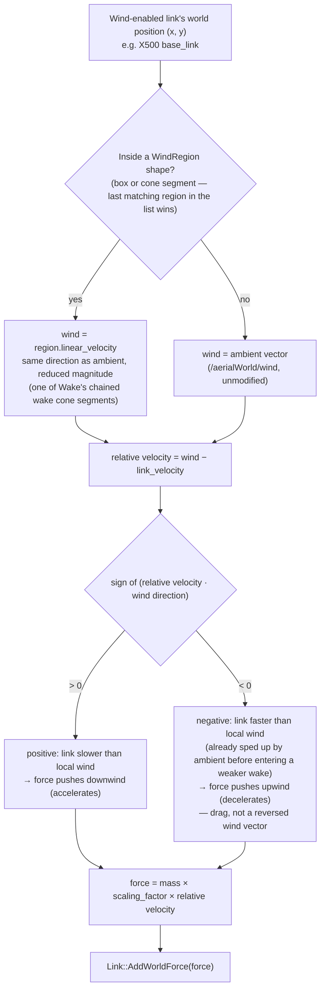
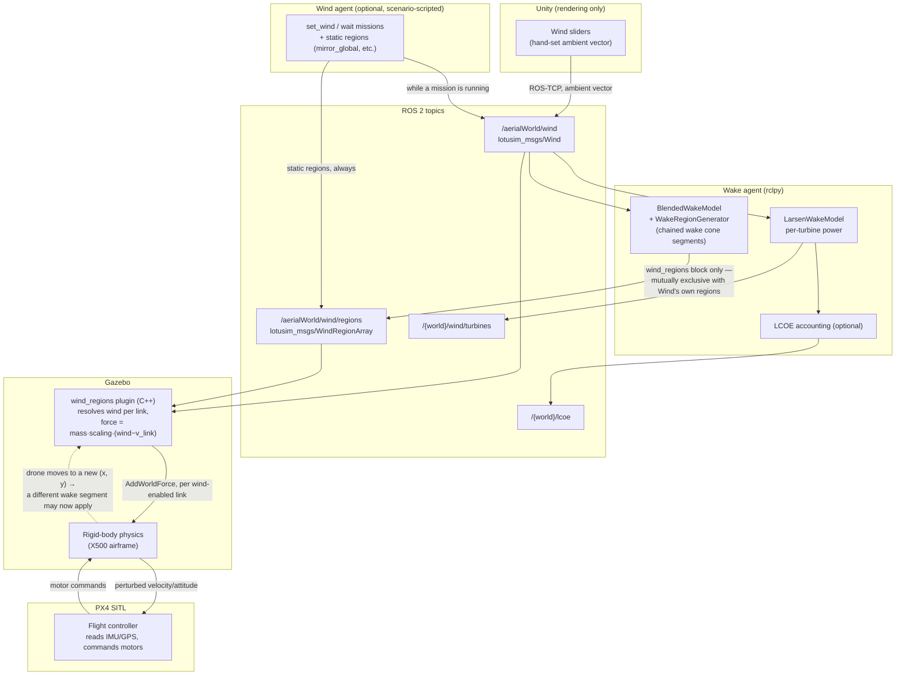

# Wake effect — forces and data flow

Companion to [`ARCHITECTURE.md` §9](ARCHITECTURE.md#9-wind-and-wake-agentsenvironment)
and the `wind_regions` section of [`WRITE_SCENARIO.md`](WRITE_SCENARIO.md).
Two diagrams: the force actually applied to a wind-enabled vehicle at a given
instant, and the full path a wind value takes from the Unity sliders to a
PX4-controlled drone crossing the wind farm.

---

## 1. Force diagram

Only one force formula exists in the system — `wind_regions_plugin.cpp`'s
`Update()` applies `force = mass × scaling_factor × (wind − link_velocity)` to
every wind-enabled link, every physics tick, whether that link is inside one
of `Wake`'s wake cone segments or out in the ambient wind. A wake segment
never reverses the wind vector (see the two published diagrams below) — the
force can still point upwind if the vehicle is already moving faster than the
locally reduced wind, which is a drag/deceleration effect, not a sign bug in
the segment:

The mass multiplication is stock `gz-sim-wind-effects-system`'s own
approximation, kept for physical/tuning consistency with the plugin it
replaces — it cancels mass out of the resulting acceleration, so a heavy
airframe doesn't visibly under-react compared to a light one.

---

## 2. Processing diagram — sliders to a PX4 drone crossing the farm

Two things this diagram makes explicit:

- **`Wake` is the only place the wind is interpreted twice**, for two
  different consumers: `LarsenWakeModel` turns it into turbine power and,
  optionally, LCOE (never touches a wind-enabled vehicle); `BlendedWakeModel`
  + `WakeRegionGenerator` turn the same ambient reading into the wake cone
  segments a vehicle actually flies through. Neither model knows about PX4 or
  the drone — they only ever produce ROS messages that Gazebo's plugin later
  resolves.
- **The physics/PX4 loop (dashed edge) is the only part that is per-tick.**
  Everything upstream of `/aerialWorld/wind/regions` only recomputes when the
  ambient wind itself changes enough (`wind_changed_enough`'s hysteresis) —
  the drone can cross many wake segments between two such recomputations,
  simply by moving through an already-published, static chain of segments.
