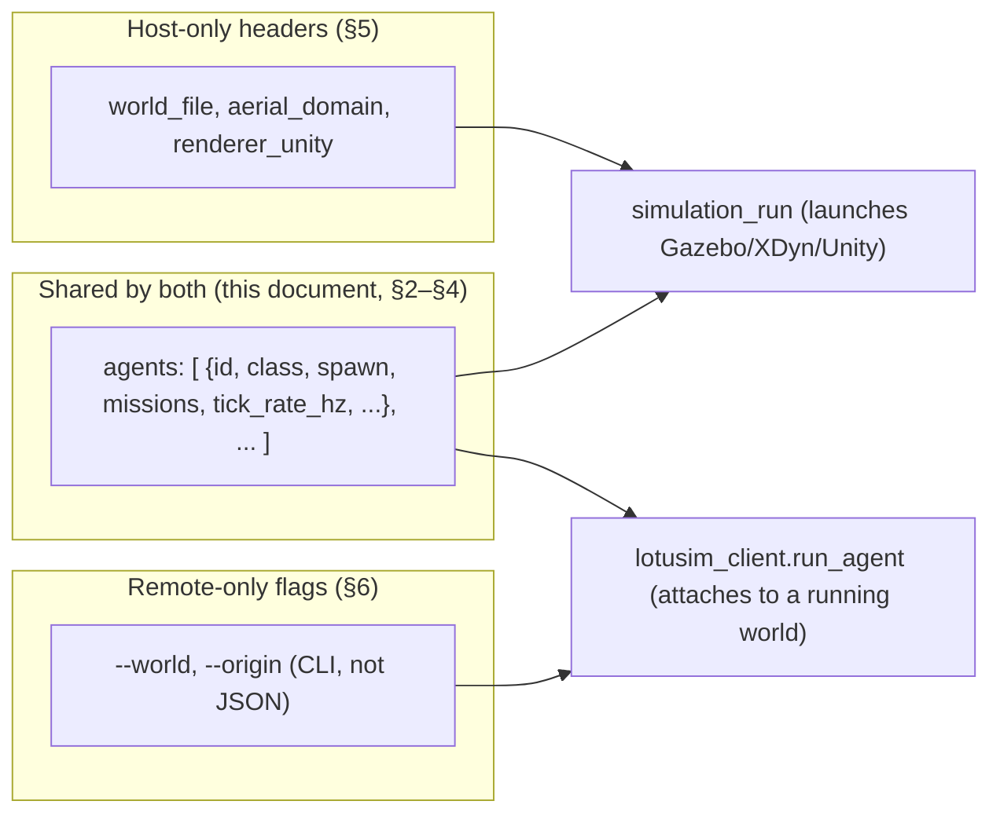

# Writing a scenario JSON

A practical, exhaustive reference for the scenario JSON format: every
top-level key, every per-agent key, spawn pose resolution, and every
parameter of every built-in BT task — followed by what's specific to writing
a **host** scenario vs. a **remote** one.

> Scope note: this document is the parameter reference and worked examples.
> For *why* the format looks like this (the BT engine, task lifecycle,
> composites), see [`MISSIONS.md`](MISSIONS.md). For repository/package
> layout, see [`ARCHITECTURE.md`](ARCHITECTURE.md).

---

## 1. One format, two launchers

Host (`simulation_run`) and remote (`lotusim_client.run_agent`) both consume
the **same** per-agent schema — `id`/`class`, `spawn`, `missions`,
`tick_rate_hz`, etc. all mean exactly the same thing and are parsed by
near-identical code on both sides
(`simulation_run/agents_manager.py::_process_single_agent_type` and
`lotusim_client/run_agent.py::main`). A mission tree copy-pasted from a host
config into a remote one works unchanged.

What differs is the **top-level "headers"**: `world_file`, `aerial_domain`,
`renderer_unity` — these tell the *host* which world/XDyn processes/Unity to
launch. The remote machine never launches Gazebo, so it has no use for them;
it gets the equivalent information (which world to attach to, the world's
geographic origin) from CLI flags instead (`--world`, `--origin`). This is
covered in full in §5 and §6.



---

## 2. The agent object — every key

Each entry of the `agents` list (host) or config object (remote, §6) accepts:

| Key | Type | Default | Meaning |
|---|---|---|---|
| `id` | string | class name, lowercased | Base name for instances: `nb_agents=3` with `"id": "patrol"` spawns `patrol0`, `patrol1`, `patrol2`. |
| `class` (or `type`) | string | — (required) | Resolved to a Python class via the `lotusim.agents` entry point (e.g. `"Bluerov2_heavy"`, `"Bluerov2_heavy_inspection"`, `"Wamv"`, `"X500"`, any custom agent). Case/underscore-insensitive matching (`normalize_agent_name`). |
| `nb_agents` | int | `1` | Number of instances to spawn of this entry. |
| `sdf_file` | string | `""` (model's default `model.sdf`) | Picks a specific SDF variant inside the model's asset folder, e.g. `"model-battery.sdf"` (needed for `check_battery_state`/light-actuator demos). |
| `xdyn` | bool | `false` | Enables the XDyn physics connection for this agent (needs a non-`Aerial` domain and the class's `XDYN_PORT`). A `waypoint_follower` task overrides this to a native `Kinematic` connection regardless (see [`MISSIONS.md` §4.3](MISSIONS.md#43-worked-example--waypointfollowertask)). |
| `spawn` | object `{x,y,z,roll,pitch,yaw}` | all fields `0.0` | Explicit ENU spawn pose. Highest-priority explicit form. |
| `pose` | `[x,y,z,roll,pitch,yaw]` | — | Same as `spawn`, list form (remote only, see §6). |
| `poses` | list of the above | — | One entry per instance index (`poses[i]` for the i-th of `nb_agents`); falls back if the index is out of range (host: random pose; remote: `poses[0]`). |
| `tick_rate_hz` | float | `1.0` | BT mission tick frequency for this agent — independent per agent. |
| `missions` | list of BT nodes | `[]` | The behaviour tree(s) — see §4. Omit entirely for a bare spawn with no behaviour. |

Any other key is passed through to the agent class's constructor as
`**kwargs` and/or is specific to the launcher (host vs. remote, §5/§6).

---

## 3. Spawn pose resolution

Both launchers apply the **same priority order**, implemented once per
side (`AgentsManager._resolve_spawn_pose` / `run_agent._resolve_pose`):

| Priority | Source | Host | Remote |
|---|---|---|---|
| 1 | `spawn` block | ✅ | ✅ |
| 2 | `poses[i]` (per-instance) | ✅ (if no `spawn`) | ✅ (checked before `spawn`... see note) |
| 3 | `pose` (single list) | — | ✅ |
| 4 | `lat`/`lon` (+ world origin) | — | ✅ (projected to ENU; **GeoPoint fallback ignores altitude** if no origin is available, see §6) |
| 5 | fallback | random pose in the agent's domain range (`generate_random_pose`) | `[0,0,0,0,0,0]` |

> On the remote, `_resolve_pose` actually checks `spawn` first, then
> `poses`, then `pose`, then `lat`/`lon` — put only **one** of these per
> agent to avoid ambiguity. There is currently **no** `depth`/`altitude`
> shorthand key implemented in either launcher — despite being mentioned in
> some older material, the code only understands `spawn`/`pose`/`poses`/
> `lat`+`lon`. If you need a specific depth or altitude, put it directly as
> the `z` field of `spawn` (ENU: negative = underwater, positive = above
> ground/sea level).

`lat`/`lon` (remote only) needs a **world geographic origin** to convert to
ENU — see §6.2. Without one, the agent spawns via a raw `GeoPoint`, which the
host's entity manager places correctly in latitude/longitude but **ignores
the altitude of** — the agent surfaces instead of spawning at depth.

---

## 4. The `missions` block — full BT parameter reference

A mission is a tree of nodes; every node is a **composite** (has `children`)
or a **leaf** (has a `task`). Full engine semantics are in
[`MISSIONS.md`](MISSIONS.md) — this section is the exhaustive parameter
listing.

### 4.1 Composite nodes

| `type` | Extra fields | Semantics |
|---|---|---|
| `sequence` | `children: [...]` | Runs children in order (logical AND); stays on the current child while it returns `RUNNING`; aborts on the first `FAILURE`; `SUCCESS` once every child has succeeded. |
| `parallel` | `children: [...]`, `success_policy: "all"\|"one"` (default `"all"`) | Ticks every non-terminal child every tick; `FAILURE` if any child fails; `SUCCESS` per `success_policy`; `RUNNING` otherwise. |

Every node (composite or leaf) may also carry an `id` (string) — a free-form
label, used only for readability/logs, not required to be unique.

### 4.2 Leaf nodes

```jsonc
{ "id": "...", "type": "action" | "condition", "task": "<registry name>",
  "params": { /* task-specific, see 4.3 */ } }
```

`type` is `"action"` or `"condition"` — purely documentation today (both are
built identically); a `condition` leaf is expected by convention to never
return `RUNNING`, but the engine does not enforce it.

### 4.3 Built-in tasks (`lotusim_sdk`, entry-point group `lotusim.tasks`)

#### `waypoint_follower` → `WaypointFollowerTask`

Closed-loop guidance to a list of waypoints, run **on the agent node**
(works identically host-side or remote — see
[`MISSIONS.md` §4.3](MISSIONS.md#43-worked-example--waypointfollowertask)).
Returns `RUNNING` until within `range_tolerance` of the final waypoint (then
`SUCCESS`, unless `loop: true`, which never terminates); `FAILURE` if no
waypoints could be resolved.

| Param | Type | Default | Notes |
|---|---|---|---|
| `waypoints` | `[{"lat","lon"}, ...]` | — | Inline list. Takes priority over `waypoints_file`. |
| `waypoints_file` | string | — | Patrol-file name, resolved via `PatrolFileProvider` relative to the scenario JSON's own directory (`_config_dir`) — same format as [`waypoint_windturbine7.json`](../src/simulation_run/config/waypoint_windturbine7.json) (`{"mmsi": ..., "waypoints": [{"timestamp","lat","lon"}, ...]}`). |
| `loop` | bool | `true` | Loop back to the first waypoint after the last, forever (`RUNNING` never ends). |
| `control_rate_hz` | float | `20.0` | Frequency of the guidance/control loop (independent of `tick_rate_hz`, which only paces the BT `tick()`). |
| `guidance_mode` | `"bang_bang"` \| `"pid"` | `"bang_bang"` | Controller family for both linear and angular velocity. |
| `range_tolerance` | float (m) | `0.5` | Distance to a waypoint at which it counts as reached. |
| `linear_velocities_limits` | `[min, max]` (m/s) | `[0.0, 15.0]` | Forward speed bounds. |
| `linear_accel_limit` | float (m/s²) | `0.5` | Forward acceleration limit. |
| `angular_velocities_limits` | float (rad/s) | `0.05` | Max yaw rate. |
| `angular_accel_limit` | float (rad/s²) | `0.5` | Yaw acceleration limit. |
| `angular_pid` | `[kp, ki, kd]` | `(0.8, 0.05, 0.4)` | Only meaningfully tunable; used by both guidance modes for heading control. |

Requires the world's geographic origin to be available (`host._world_origin`)
to project `lat`/`lon` waypoints into the same ENU frame Gazebo uses — see
§5.2 (host, automatic) and §6.2 (remote, via `--origin`/config `origin`).

#### `fault_inspection` → `FaultInspectionTask`

Camera-based corrosion/crack detection (HSV + YOLO). Event-driven:
`update()` always returns `RUNNING`; detections are published as they arrive
on the camera subscription. Full threading/QoS write-up.

| Param | Type | Default | Notes |
|---|---|---|---|
| `show_window` | bool | `false` | Opens a live OpenCV debug window with annotated detections. Requires a GUI-capable display on the machine actually ticking this task (host or remote) — leave `false` on a headless box. |

Subscribes `/{world}/{agent}/inspection/image`
(`sensor_msgs/CompressedImage`); publishes JSON detections on
`/{world}/{agent}/inspection/detections` (`std_msgs/String`,
`TRANSIENT_LOCAL`).

#### `check_battery_state` → `CheckBatteryStateTask`

Drives the agent's status LED from its battery level. Event-driven:
`update()` always returns `RUNNING`; the real work happens in the battery
callback (edge-triggered — only publishes on a state change).

| Param | Type | Default | Notes |
|---|---|---|---|
| `threshold` | float (%) | `80.0` | Battery percentage above which the light turns ON. |

Subscribes `/{world}/{agent}/battery/state` (`sensor_msgs/BatteryState`,
`TRANSIENT_LOCAL`); publishes `/{world}/{agent}/light/cmd` (`std_msgs/Bool`,
`TRANSIENT_LOCAL`). Requires the spawned model to bundle a `battery_sensor`
+ `light_actuator` (e.g. `model-battery.sdf`).

#### Tasks shipped outside `lotusim_sdk`

A task doesn't have to live in the SDK — `blink_light`
(`BlinkLightTask`, in `external_packages/custom_task_demo`) is a full
example of a package-shipped task, still usable by name from **any**
scenario JSON on **any** agent (params: `period_s`, float, default `1.0`) —
see [`MISSIONS.md` §4.4](MISSIONS.md#44-custom-tasks-and-code-built-missions-custom_task_demo)
and §7 below for how to add your own.

### 4.4 Worked example — sequential patrol then concurrent monitoring

```json
{
  "id": "patrol_then_inspect",
  "class": "Bluerov2_heavy_inspection",
  "sdf_file": "model-battery.sdf",
  "spawn": { "x": 0.0, "y": 0.0, "z": -10.0, "yaw": 0.0 },
  "tick_rate_hz": 2.0,
  "missions": [
    {
      "id": "patrol_then_inspect_mission",
      "type": "sequence",
      "children": [
        { "id": "reach_turbine", "type": "action", "task": "waypoint_follower",
          "params": {
            "loop": false, "guidance_mode": "bang_bang",
            "waypoints": [ { "lat": 50.32950, "lon": -4.19400 } ]
          } },
        { "id": "inspect_and_monitor", "type": "parallel", "success_policy": "all",
          "children": [
            { "id": "corrosion_crack_inspection", "type": "action",
              "task": "fault_inspection", "params": { "show_window": true } },
            { "id": "led_from_battery", "type": "action",
              "task": "check_battery_state", "params": { "threshold": 80.0 } }
          ] }
      ]
    }
  ]
}
```

Full file: [`src/simulation_run/config/sequence_and_parallel.json`](../src/simulation_run/config/sequence_and_parallel.json).

---

## 5. Writing a HOST scenario

Host configs live in `src/simulation_run/config/*.json` and add the
top-level keys that tell `simulation_run` what to launch:

| Key | Type | Default | Meaning |
|---|---|---|---|
| `world_file` | string | `""` | Gazebo world SDF file name (from `$LOTUSIM_PATH/assets/worlds/`), e.g. `"energy.world"`. Its `<spherical_coordinates>` block is read automatically for `waypoint_follower`'s ENU projection (§5.2) — no `origin` key needed host-side. |
| `agents` | list (current) or dict (legacy, see below) | `[]` | See §2. |
| `aerial_domain` | bool | `false` | Whether an aerial-domain world is also launched (needed for `X500`/aerial agents). |
| `renderer_unity` | bool | `false` | Whether `scenario_launch.sh` starts the ROS↔Unity TCP bridge and the Unity executable. |

### 5.1 Running it

```bash
./src/simulation_run/executable/scenario_launch.sh --config sequence_and_parallel.json
# or directly, once workspaces are sourced:
ros2 run simulation_run main --config sequence_and_parallel.json
```

`scenario_launch.sh` reads `renderer_unity`/`aerial_domain` via `jq`, cleans
up stale processes, launches one `xdyn-for-cs` per agent type that has
`"xdyn": true` (mapped by class name to a `.yml`/port in the script's
`XDYN_CONFIGS` table), optionally the Unity executable and TCP bridge, then
`ros2 run simulation_run main --config ...` (see the full sequence diagram
in [`ARCHITECTURE.md` §5](ARCHITECTURE.md#5-host-orchestration-flow-simulation_run)).
`--debug` and `--gui` are also accepted and forwarded.

### 5.2 World origin — automatic

Host-side, `AgentsManager.add_agents()` reads `(lat0, lon0)` straight from
the world SDF's `<spherical_coordinates>` block
(`utils._extract_world_spherical_coords`) and sets it as `_world_origin` on
every agent **before** `set_missions()` builds its tasks — so
`waypoint_follower` always has a projection origin with zero extra
configuration. This is the one piece of host convenience the remote launcher
cannot provide for itself (§6.2).

### 5.3 The `Wind` environment agent

`Wind` is not a `PhysicalEntity` — no SDF, no spawn, no `missions`. It is
declared like any other entry in the **legacy dict form** of `agents` (see
§5.4) because its configuration is flat parameters, not a BT mission:

```json
"agents": {
  "Wind": {
    "wake_model": "jensen",
    "model_params": { "kw": 0.065 },
    "diameter": 61.0, "ct": 0.8, "cp": 0.35,
    "air_density": 1.225, "cut_in": 5.0, "cut_out": 25.0,
    "maintenance_cost": 100000.0,
    "lcoe": { "alpha_r_aud_per_hour": 50.0, "alpha_e_aud_per_kwh": 0.5, "publish_rate_hz": 1.0 },
    "turbines": [ { "name": "wind_turbine_1", "x": 307.5, "y": 85.03, "z": -29.5 }, "..." ]
  }
}
```

See [`ARCHITECTURE.md` §9](ARCHITECTURE.md#9-wind-agentsenvironmentwind) for
what each field feeds into (wake model choice, LCOE computation). Full file:
[`src/simulation_run/config/wind_only.json`](../src/simulation_run/config/wind_only.json).

### 5.4 Legacy dict form of `agents`

`AgentsManager._iter_agents` still accepts the pre-mission-system shape —
`agents` as a **dict** keyed by class name instead of a list of objects:

```jsonc
"agents": {
  "Bluerov2_heavy": { "nb_agents": 2, "poses": [[...], [...]], "xdyn": true }
}
```

Both shapes can appear in the wild (`wind_only.json`, `empty.json` still use
the dict form because they have no `missions`); for a **new** scenario with
BT missions, prefer the **list** form (`"agents": [ {"id", "class", ...} ]`)
— it is what every task/mission-carrying example in this repo uses, and
what `find_waypoints_file_in_missions`/`extract_spawn_from_missions` are
written against.

---

## 6. Writing a REMOTE scenario

Remote configs (e.g. `deployment/my_config.json`) have **no**
`world_file`/`aerial_domain`/`renderer_unity` — the remote machine never
launches Gazebo/XDyn/Unity, it only attaches to a world the host already has
running. Everything those headers would have configured instead comes from
`run_agent`'s **CLI flags**:

```bash
python3 -m lotusim_client.run_agent \
    --world energy \
    --config my_config.json \
    --origin 50.32879166666667 -4.195226666666667
```

| Flag | Required | Meaning |
|---|---|---|
| `--world` | ✅ | Must match the `world_name` the host scenario is running (i.e. the `<world name="...">` inside the host's `world_file`, not the file name itself). |
| `--config` / `--json` | one of the two | Path to a JSON file, or an inline JSON string. |
| `--origin LAT LON` | only if any agent uses `lat`/`lon` spawn or `waypoint_follower` | World geographic origin — see §6.2. Overrides a config-level `origin`. |

### 6.1 Config shape — two accepted forms

`run_agent.py` accepts either shape (§2's per-agent keys are identical in
both):

**A. The same `"agents": [...]` list form the host uses** — copy a host
scenario's agent entries verbatim (minus `world_file`/`aerial_domain`/
`renderer_unity`, which `run_agent` ignores if present):

```json
{
  "origin": [50.32879166666667, -4.195226666666667],
  "agents": [
    { "id": "patrol", "class": "Bluerov2_heavy", "spawn": {"z": -10.0}, "missions": [ "..." ] }
  ]
}
```

**B. The flat legacy form**, keyed directly by class name at the top level
(what `deployment/my_config.json` uses) — convenient for a single quick
agent, no `"agents"` wrapper or `"id"`/`"class"` needed (the top-level key
*is* the class name, and doubles as the `id`):

```json
{
  "MyBluerov": {
    "origin": [50.32879166666667, -4.195226666666667],
    "nb_agents": 2,
    "tick_rate_hz": 1.0,
    "sdf_file": "model-battery.sdf",
    "poses": [ [0.0, 0.0, -10.0, 0,0,0], [-6.0, 0.0, -10.0, 0,0,0] ],
    "missions": [ "..." ]
  }
}
```

A top-level `origin` key (either shared, as in shape A, or per-agent, as in
shape B) is popped/read before agent processing in either shape; the
`--origin` CLI flag always takes priority over both.

### 6.2 World origin — must be supplied explicitly

Unlike the host (§5.2), the remote machine has no world SDF file to read
`<spherical_coordinates>` from, so **you must supply the origin yourself**
whenever an agent needs geo→ENU conversion (`lat`/`lon` spawn, or any
`waypoint_follower` task):

1. Read `latitude_deg`/`longitude_deg` from the world file's
   `<spherical_coordinates>` block (ask whoever runs the host, or check
   `$LOTUSIM_PATH/assets/worlds/<world>.world` if you have access) — for the
   `energy` world it is `50.32879166666667 -4.195226666666667`.
2. Pass it via `--origin LAT LON`, or a config `"origin": [lat, lon]` (top
   level or per-agent) — `--origin` wins if both are given.

**Without an origin, an agent using `lat`/`lon` spawns via a raw `GeoPoint`,
which the host's entity manager places correctly in latitude/longitude but
silently ignores the altitude of** — the agent surfaces instead of spawning
at the intended depth. This is the single most common "my ROV keeps popping
up at the surface" mistake when running remote.

### 6.3 `reuse_existing` (remote-only)

```json
{ "MyBluerov": { "reuse_existing": true, "spawn": {"z": -10.0} } }
```

If `true` and an entity under this agent's name is **already** present in
Gazebo (detected during the initial discovery window), `run_agent` skips
sending a new `CREATE_CMD` and just re-attaches its mission to the existing
entity — useful when restarting a crashed remote process against a
still-running host, on the **same** machine. Leave it `false` (default) for
the normal case (including any true multi-machine setup): the host is the
single authority on entity names and deconflicts duplicates only through a
fresh `CREATE_CMD`.

### 6.4 Running it — end to end

```bash
# 1. one-time, per remote machine (see deployment/README.md for the full walkthrough)
source /opt/ros/jazzy/setup.bash
pip install dist/lotusim_sdk-*.whl dist/lotusim_client-*.whl
cd deployment && colcon build && source install/setup.bash
source setup_ros_network.sh   # matches ROS_DOMAIN_ID with the host

# 2. every run
python3 -m lotusim_client.run_agent --world energy --config my_config.json \
    --origin 50.32879166666667 -4.195226666666667
```

Ctrl+C halts every mission's BT roots, sends `DELETE_CMD` for every spawned
agent, and shuts down cleanly (see the remote half of the sequence diagram
in [`ARCHITECTURE.md` §5](ARCHITECTURE.md#5-host-orchestration-flow-simulation_run)).
Full walkthrough, troubleshooting, and the JSON key reference table:
[`deployment/README.md`](../deployment/README.md).

---

## 7. Adding your own agent class or task to a scenario

Not a JSON concern, but the natural next step once a stock combination of
agent + built-in tasks isn't enough:

- **New task** — subclass `TaskAgent`, register it under `lotusim.tasks` in
  your own package's `setup.py`, reference it by name from `missions` on
  **any** agent, host or remote — no core-repo edit. Full guide:
  [`MISSIONS.md` §7.1](MISSIONS.md#71-adding-a-task--no-core-repo-edit-required).
- **New agent class** — subclass a base vehicle (`Bluerov2Heavy`, `Wamv`,
  `X500`, ...), set `renderer_type_name`, register it under `lotusim.agents`.
  Reference template: `deployment/src/example_agent` (remote) or any
  `external_packages/*` package (host) — see
  [`ARCHITECTURE.md` §2](ARCHITECTURE.md#2-package-tree-src).
