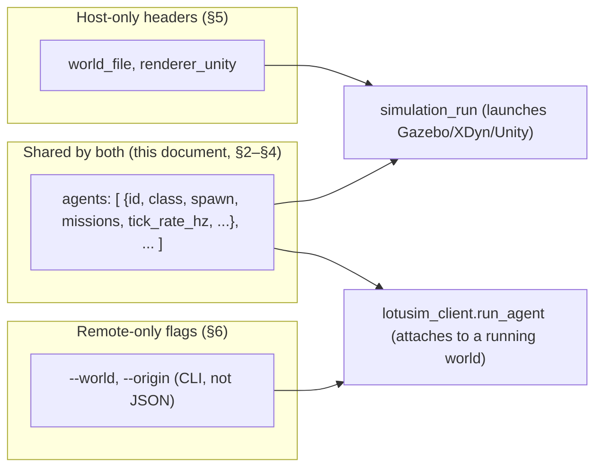

# Writing a scenario JSON

A practical, exhaustive reference for the scenario JSON format: every
top-level key, every per-agent key, spawn pose resolution, and every
parameter of every built-in BT task — followed by what's specific to writing
a **host** scenario vs. a **remote** one.

> Scope note: this document is the parameter reference and worked examples.
> For *why* the format looks like this (the BT engine, task lifecycle,
> composites), see [`MISSIONS.md`](MISSIONS.md). For repository/package
> layout, see [`ARCHITECTURE.md`](ARCHITECTURE.md).

---

## 1. One format, two launchers

Host (`simulation_run`) and remote (`lotusim_client.run_agent`) both consume
the **same** per-agent schema — `id`/`class`, `spawn`, `missions`,
`tick_rate_hz`, etc. all mean exactly the same thing and are parsed by
near-identical code on both sides
(`simulation_run/agents_manager.py::_process_single_agent_type` and
`lotusim_client/run_agent.py::main`). A mission tree copy-pasted from a host
config into a remote one works unchanged.

What differs is the **top-level "headers"**: `world_file`,
`renderer_unity` — these tell the *host* which world/XDyn processes/Unity to
launch. The remote machine never launches Gazebo, so it has no use for them;
it gets the equivalent information (which world to attach to, the world's
geographic origin) from CLI flags instead (`--world`, `--origin`). This is
covered in full in §5 and §6.


```mermaid
flowchart LR
    subgraph Shared["Shared by both (this document, §2–§4)"]
        AGENTS["agents: [ {id, class, spawn, missions, tick_rate_hz, ...}, ... ]"]
    end
    subgraph HostOnly["Host-only headers (§5)"]
        H["world_file, renderer_unity"]
    end
    subgraph RemoteOnly["Remote-only flags (§6)"]
        R["--world, --origin (CLI, not JSON)"]
    end
    H --> HOST["simulation_run (launches Gazebo/XDyn/Unity)"]
    AGENTS --> HOST
    AGENTS --> REMOTE["lotusim_client.run_agent (attaches to a running world)"]
    R --> REMOTE
```

---

## 2. The agent object — every key

Each entry of the `agents` list (host) or config object (remote, §6) accepts:

| Key | Type | Default | Meaning |
|---|---|---|---|
| `id` | string | class name, lowercased | Base name for instances: `nb_agents=3` with `"id": "patrol"` spawns `patrol0`, `patrol1`, `patrol2`. |
| `class` (or `type`) | string | — (required) | Resolved to a Python class via the `lotusim.agents` entry point (e.g. `"Bluerov2_heavy"`, `"Bluerov2_heavy_inspection"`, `"Wamv"`, `"X500"`, any custom agent). Case/underscore-insensitive matching (`normalize_agent_name`). |
| `nb_agents` | int | `1` | Number of instances to spawn of this entry. |
| `sdf_file` | string | `""` (model's default `model.sdf`) | Picks a specific SDF variant inside the model's asset folder, e.g. `"model-battery.sdf"` (needed for `check_battery_state`/light-actuator demos). |
| `xdyn` | bool | `false` | Enables the XDyn physics connection for this agent (needs a non-`Aerial` domain and the class's `XDYN_PORT`). A `waypoint_follower` task overrides this to a native `Kinematic` connection regardless (see [`MISSIONS.md` §4.3](MISSIONS.md#43-worked-example--waypointfollowertask)). |
| `spawn` | object `{x,y,z,roll,pitch,yaw}` | all fields `0.0` | Explicit ENU spawn pose. Highest-priority explicit form. |
| `pose` | `[x,y,z,roll,pitch,yaw]` | — | Same as `spawn`, list form (remote only, see §6). |
| `poses` | list of the above | — | One entry per instance index (`poses[i]` for the i-th of `nb_agents`); falls back if the index is out of range (host: random pose; remote: `poses[0]`). |
| `tick_rate_hz` | float | `1.0` | BT mission tick frequency for this agent — independent per agent. |
| `missions` | list of BT nodes | `[]` | The behaviour tree(s) — see §4. Omit entirely for a bare spawn with no behaviour. |

Any other key is passed through to the agent class's constructor as
`**kwargs` and/or is specific to the launcher (host vs. remote, §5/§6).

---

## 3. Spawn pose resolution

Both launchers apply the **same priority order**, implemented once per
side (`AgentsManager._resolve_spawn_pose` / `run_agent._resolve_pose`):

| Priority | Source | Host | Remote |
|---|---|---|---|
| 1 | `spawn` block | ✅ | ✅ |
| 2 | `poses[i]` (per-instance) | ✅ (if no `spawn`) | ✅ (checked before `spawn`... see note) |
| 3 | `pose` (single list) | — | ✅ |
| 4 | `lat`/`lon` (+ world origin) | — | ✅ (projected to ENU; **GeoPoint fallback ignores altitude** if no origin is available, see §6) |
| 5 | fallback | random pose in the agent's domain range (`generate_random_pose`) | `[0,0,0,0,0,0]` |

> On the remote, `_resolve_pose` actually checks `spawn` first, then
> `poses`, then `pose`, then `lat`/`lon` — put only **one** of these per
> agent to avoid ambiguity. There is currently **no** `depth`/`altitude`
> shorthand key implemented in either launcher — despite being mentioned in
> some older material, the code only understands `spawn`/`pose`/`poses`/
> `lat`+`lon`. If you need a specific depth or altitude, put it directly as
> the `z` field of `spawn` (ENU: negative = underwater, positive = above
> ground/sea level).

`lat`/`lon` (remote only) needs a **world geographic origin** to convert to
ENU — see §6.2. Without one, the agent spawns via a raw `GeoPoint`, which the
host's entity manager places correctly in latitude/longitude but **ignores
the altitude of** — the agent surfaces instead of spawning at depth.

---

## 4. The `missions` block — full BT parameter reference

A mission is a tree of nodes; every node is a **composite** (has `children`)
or a **leaf** (has a `task`). Full engine semantics are in
[`MISSIONS.md`](MISSIONS.md) — this section is the exhaustive parameter
listing.

### 4.1 Composite nodes

| `type` | Extra fields | Semantics |
|---|---|---|
| `sequence` | `children: [...]` | Runs children in order (logical AND); stays on the current child while it returns `RUNNING`; aborts on the first `FAILURE`; `SUCCESS` once every child has succeeded. |
| `parallel` | `children: [...]`, `success_policy: "all"\|"one"` (default `"all"`) | Ticks every non-terminal child every tick; `FAILURE` if any child fails; `SUCCESS` per `success_policy`; `RUNNING` otherwise. |

Every node (composite or leaf) may also carry an `id` (string) — a free-form
label, used only for readability/logs, not required to be unique.

### 4.2 Leaf nodes

```jsonc
{ "id": "...", "type": "action" | "condition", "task": "<registry name>",
  "params": { /* task-specific, see 4.3 */ } }
```

`type` is `"action"` or `"condition"` — purely documentation today (both are
built identically); a `condition` leaf is expected by convention to never
return `RUNNING`, but the engine does not enforce it.

### 4.3 Built-in tasks (`lotusim_sdk`, entry-point group `lotusim.tasks`)

#### `waypoint_follower` → `WaypointFollowerTask`

Closed-loop guidance to a list of waypoints, run **on the agent node**
(works identically host-side or remote — see
[`MISSIONS.md` §4.3](MISSIONS.md#43-worked-example--waypointfollowertask)).
Returns `RUNNING` until within `range_tolerance` of the final waypoint (then
`SUCCESS`, unless `loop: true`, which never terminates); `FAILURE` if no
waypoints could be resolved.

| Param | Type | Default | Notes |
|---|---|---|---|
| `waypoints` | `[{"lat","lon"}, ...]` | — | Inline list. Takes priority over `waypoints_file`. |
| `waypoints_file` | string | — | Patrol-file name, resolved via `PatrolFileProvider` relative to the scenario JSON's own directory (`_config_dir`) — same format as [`waypoints/waypoint_windturbine1.json`](../src/simulation_run/config/waypoints/waypoint_windturbine1.json) (`{"mmsi": ..., "waypoints": [{"timestamp","lat","lon"}, ...]}`). |
| `loop` | bool | `true` | Loop back to the first waypoint after the last, forever (`RUNNING` never ends). |
| `control_rate_hz` | float | `20.0` | Frequency of the guidance/control loop (independent of `tick_rate_hz`, which only paces the BT `tick()`). |
| `guidance_mode` | `"bang_bang"` \| `"pid"` | `"bang_bang"` | Controller family for both linear and angular velocity. |
| `range_tolerance` | float (m) | `0.5` | Distance to a waypoint at which it counts as reached. |
| `linear_velocities_limits` | `[min, max]` (m/s) | `[0.0, 15.0]` | Forward speed bounds. |
| `linear_accel_limit` | float (m/s²) | `0.5` | Forward acceleration limit. |
| `angular_velocities_limits` | float (rad/s) | `0.05` | Max yaw rate. |
| `angular_accel_limit` | float (rad/s²) | `0.5` | Yaw acceleration limit. |
| `angular_pid` | `[kp, ki, kd]` | `(0.8, 0.05, 0.4)` | Only meaningfully tunable; used by both guidance modes for heading control. |

Requires the world's geographic origin to be available (`host._world_origin`)
to project `lat`/`lon` waypoints into the same ENU frame Gazebo uses — see
§5.2 (host, automatic) and §6.2 (remote, via `--origin`/config `origin`).

#### `waypoint_follower_avoidance` → `WaypointFollowerAvoidanceTask`

`WaypointFollowerTask` plus a fake sonar and obstacle avoidance. Same params
and semantics as `waypoint_follower` above (it's a subclass — every param in
that table also applies here), plus:

| Param | Type | Default | Notes |
|---|---|---|---|
| `sonar_range_m` | float (m) | `40.0` | Detection range AND the distance over which avoidance strength ramps to zero — one knob, no separate "avoidance radius". |
| `obstacle_prefixes` | `[string, ...]` | `["mine"]` | Agent-name prefixes treated as obstacles (matched against live names on `/<world>/poses`, e.g. a `"mine"`-classed agent spawns as `mine0`, `mine1`, ...). |
| `avoid_gain` | float | `1.5` | Repulsion weight relative to the (unit) goal direction. |

"Fake sonar" means a ground-truth proximity check against other known
entities' poses (`host.poses_of_others()`) — not a simulated acoustic/Gazebo
sensor. Avoidance only ever bends the **steering bearing**: the nearest
in-range obstacle's repulsion vector is blended with the true goal direction
before the (otherwise unchanged) bang-bang/PID heading controller runs;
arrival detection, speed ramp, and the CSV recorder's
`cross_track_error_m`/arrival columns always use the TRUE goal, so avoidance
never corrupts those metrics — it only changes what heading gets commanded.
See `lotusim_sdk/tasks/waypoint_follower_avoidance.py` for the exact blend.

#### `kinematic_anchor` → `KinematicAnchorTask`

Forces a thruster-less prop (e.g. a `mine`-classed agent) onto the
`Kinematic` connection type without ever commanding it to move — otherwise
it gets no connection type at all and the host never integrates it,
including any ocean current (§5.4). No params; `update()` always returns
`RUNNING`. Give the agent a bare mission using this task and it just sits at
its spawn pose, drifting only as much as the current (if any) pushes it:

```json
{ "id": "obstacle1_anchor", "type": "action", "task": "kinematic_anchor", "params": {} }
```

#### `fault_inspection` → `FaultInspectionTask`

Camera-based corrosion/crack detection (HSV + YOLO). Event-driven:
`update()` always returns `RUNNING`; detections are published as they arrive
on the camera subscription. Full threading/QoS write-up.

| Param | Type | Default | Notes |
|---|---|---|---|
| `show_window` | bool | `false` | Opens a live OpenCV debug window with annotated detections. Requires a GUI-capable display on the machine actually ticking this task (host or remote) — leave `false` on a headless box. |

Subscribes `/{world}/{agent}/inspection/image`
(`sensor_msgs/CompressedImage`); publishes JSON detections on
`/{world}/{agent}/inspection/detections` (`std_msgs/String`,
`TRANSIENT_LOCAL`).

#### `check_battery_state` → `CheckBatteryStateTask`

Drives the agent's status LED from its battery level. Event-driven:
`update()` always returns `RUNNING`; the real work happens in the battery
callback (edge-triggered — only publishes on a state change).

| Param | Type | Default | Notes |
|---|---|---|---|
| `threshold` | float (%) | `80.0` | Battery percentage above which the light turns ON. |

Subscribes `/{world}/{agent}/battery/state` (`sensor_msgs/BatteryState`,
`TRANSIENT_LOCAL`); publishes `/{world}/{agent}/light/cmd` (`std_msgs/Bool`,
`TRANSIENT_LOCAL`). Requires the spawned model to bundle a `battery_sensor`
+ `light_actuator` (e.g. `model-battery.sdf`).

#### `set_wind` → `SetWindTask`

Sets the ambient wind vector, then returns `SUCCESS`. Unlike every other task
here, its host is not a vehicle: it only runs on a `Wind` **environment** agent
(§5.3), which is what makes a scripted wind history expressible as a plain
`sequence`.

| Param | Type | Default | Notes |
|---|---|---|---|
| `x` / `y` / `z` | float (m/s) | current value | Wind velocity in the world ENU frame (x=East, y=North, z=Up). Omitted components are left untouched. |

Publishes `/aerialWorld/wind` (`lotusim_msgs/Wind`, `TRANSIENT_LOCAL`) through
its host agent — see §5.3 for who else reads and writes that topic.

#### `wait` → `WaitTask`

Stays `RUNNING` for `duration_s`, then returns `SUCCESS`. Any agent — it reads
and changes nothing but its own progress, so it drops safely into any
`sequence`/`parallel` next to any other task.

| Param | Type | Default | Notes |
|---|---|---|---|
| `duration_s` | float (s) | `0.0` | Wall-clock — no node in this codebase sets `use_sim_time`, so this holds regardless of Gazebo's `real_time_factor` (§4.1 uses the same clock convention). |

Mainly useful to space out a run of instantly-succeeding actions — a `Sequence`
advances through every immediately-succeeding child within the same tick (see
`lotusim_sdk/bt/composites.py`), so e.g. two `set_wind` back to back apply
instantly and only the second is ever actually observed. Interleave a `wait`:

```json
{ "id": "wind_schedule", "type": "sequence", "children": [
    { "id": "calm",      "type": "action", "task": "set_wind", "params": { "x": 0.0, "y": 0.0 } },
    { "id": "hold_calm", "type": "action", "task": "wait",     "params": { "duration_s": 30.0 } },
    { "id": "from_east", "type": "action", "task": "set_wind", "params": { "x": 8.0, "y": 0.0 } }
]}
```

#### Tasks shipped outside `lotusim_sdk`

A task doesn't have to live in the SDK — `blink_light`
(`BlinkLightTask`, in `external_packages/custom_task_demo`) is a full
example of a package-shipped task, still usable by name from **any**
scenario JSON on **any** agent (params: `period_s`, float, default `1.0`) —
see [`MISSIONS.md` §4.4](MISSIONS.md#44-custom-tasks-and-code-built-missions-custom_task_demo)
and §7 below for how to add your own.

### 4.4 Worked example — sequential patrol then concurrent monitoring

```json
{
  "id": "patrol_then_inspect",
  "class": "Bluerov2_heavy_inspection",
  "sdf_file": "model-battery.sdf",
  "spawn": { "x": 0.0, "y": 0.0, "z": -10.0, "yaw": 0.0 },
  "tick_rate_hz": 2.0,
  "missions": [
    {
      "id": "patrol_then_inspect_mission",
      "type": "sequence",
      "children": [
        { "id": "reach_turbine", "type": "action", "task": "waypoint_follower",
          "params": {
            "loop": false, "guidance_mode": "bang_bang",
            "waypoints": [ { "lat": 50.32950, "lon": -4.19400 } ]
          } },
        { "id": "inspect_and_monitor", "type": "parallel", "success_policy": "all",
          "children": [
            { "id": "corrosion_crack_inspection", "type": "action",
              "task": "fault_inspection", "params": { "show_window": true } },
            { "id": "led_from_battery", "type": "action",
              "task": "check_battery_state", "params": { "threshold": 80.0 } }
          ] }
      ]
    }
  ]
}
```

Full file: [`src/simulation_run/config/basic_examples/sequence_and_parallel.json`](../src/simulation_run/config/basic_examples/sequence_and_parallel.json).

---

## 5. Writing a HOST scenario

Host configs live in `src/simulation_run/config/*.json` and add the
top-level keys that tell `simulation_run` what to launch:

| Key | Type | Default | Meaning |
|---|---|---|---|
| `world_file` | string | `""` | Gazebo world SDF file name (from `$LOTUSIM_PATH/assets/worlds/`), e.g. `"energy.world"`. Its `<spherical_coordinates>` block is read automatically for `waypoint_follower`'s ENU projection (§5.2) — no `origin` key needed host-side. |
| `agents` | list (current) or dict (legacy, see below) | `[]` | See §2. |
| `renderer_unity` | bool | `false` | Whether `scenario_launch.sh` starts the ROS↔Unity TCP bridge and the Unity executable. |
| `record_csv` | bool or object | `false` | Enables the CSV recorder observer node — see §5.5. |

### 5.1 Running it

```bash
./src/simulation_run/executable/scenario_launch.sh --config basic_examples/sequence_and_parallel.json
# or directly, once workspaces are sourced:
ros2 run simulation_run main --config basic_examples/sequence_and_parallel.json
```

`scenario_launch.sh` reads `renderer_unity` via `jq`, cleans
up stale processes, launches one `xdyn-for-cs` per agent type that has
`"xdyn": true` (mapped by class name to a `.yml`/port in the script's
`XDYN_CONFIGS` table), optionally the Unity executable and TCP bridge, then
`ros2 run simulation_run main --config ...` (see the full sequence diagram
in [`ARCHITECTURE.md` §5](ARCHITECTURE.md#5-host-orchestration-flow-simulation_run)).
`--debug` and `--gui` are also accepted and forwarded.

`UNITY_MODE` (env var, default `exe`) controls how Unity rendering is
brought up when `renderer_unity: true`:

- `exe` (default) — launches the pre-built Unity player
  (`lotusim_unity_executables/<build>/*.x86_64` etc).
- `editor` — skips that; the script just prints a reminder and still starts
  everything else (ROS/Gazebo/TCP bridge). Open the matching Unity project
  in the Editor yourself (via Unity Hub — the project must already be added
  there, matching Editor version installed) and press Play, e.g.:
  ```bash
  UNITY_MODE=editor ./src/simulation_run/executable/scenario_launch.sh --config my_scenario.json
  ```
  Start the script first, so the ROS-TCP-Endpoint bridge is already
  listening before Unity's ROS-TCP-Connector (in the Editor) tries to
  connect to it — same ordering as `exe` mode, which launches the bridge
  before the player too.

### 5.2 World origin — automatic

Host-side, `AgentsManager.add_agents()` reads `(lat0, lon0)` straight from
the world SDF's `<spherical_coordinates>` block
(`utils._extract_world_spherical_coords`) and sets it as `_world_origin` on
every agent **before** `set_missions()` builds its tasks — so
`waypoint_follower` always has a projection origin with zero extra
configuration. This is the one piece of host convenience the remote launcher
cannot provide for itself (§6.2).

### 5.3 Wind: the `Wind` and `Wake` environment agents

The ambient (global) wind hangs off **one topic**, `/aerialWorld/wind`
(`lotusim_msgs/Wind`, an ENU velocity vector in m/s). Hardcoded, like the
aerial world itself. Three parties touch it and none know about each other:

```
Unity wind sliders ─┐
                    ├──> /aerialWorld/wind ──┬──> wind_regions plugin ──> forces on vehicles
Wind agent ─────────┘                        │    (Gazebo, subscribes to
        │                                    │     ROS directly — no bridge)
        │                                    └──> Wake agent ──> /<world>/wind/turbines, /<world>/lcoe
        │                                                     │  (turbine power, farm economics;
        │                                                     │  always reads the ambient vector,
        │                                                     │  never regions)
        │                                                     └──> /aerialWorld/wind/regions
        │                                                          (wind_regions block, optional —
        │                                                          the wake footprint itself, as cones)
        └──> /aerialWorld/wind/regions ──> wind_regions plugin
             (lotusim_msgs/WindRegionArray; Wind's own static `regions`, optional)
```

`/aerialWorld/wind/regions` has **two possible writers** — `Wind` (static
`regions`, below) and `Wake` (dynamic `wind_regions`, further down) — and they
do not know about each other any more than the three parties on the ambient
topic do. See the `Wake` section for why declaring both in one scenario is a
mistake, not a feature.

The aerial world is always started — it is infrastructure, not a scenario
option — and the `wind_regions` Gazebo plugin that lives in it embeds its own
ROS node, so there is no separate bridge process to start or stop. So the only
question a scenario answers is **who writes the topic, and when**.

#### `Wind` — writing the ambient wind from a mission, and only then

`Wind` holds one vector and republishes it at `publish_rate_hz` — but **only
while one of its own missions is actively running**. With no `missions`
declared, or once every declared mission has finished (reached
`SUCCESS`/`FAILURE`), it publishes nothing at all on `/aerialWorld/wind`: the
sliders are the only writer on the topic and free hand-tuning behaves exactly
as if no `Wind` agent were declared.

```json
{ "id": "wind", "class": "Wind", "x": 8.0, "y": 0.0, "z": 0.0, "publish_rate_hz": 10.0 }
```

| Field | Type | Default | Meaning |
|---|---|---|---|
| `x` / `y` / `z` | float | `0.0` | Ambient wind velocity in m/s, world ENU frame (x=East, y=North, z=Up), used as the starting held value once a mission claims the topic. |
| `publish_rate_hz` | float | `10.0` | How often the held vector (and the `regions` list below) is republished. |
| `regions` | list | `[]` | Optional 2D wind regions overriding the ambient vector — see below. |

With no `missions` at all (as above) this agent is a **legitimate no-op** for
the ambient vector — sliders are always in control, and `Wake` reads whatever
they publish. That is the right shape for a scenario that only wants wake/LCOE
modelling and free manual wind control, e.g.
[`px4_manual_wake_flying.json`](../src/simulation_run/config/wind_wake_examples/px4_manual_wake_flying.json).

#### `regions` — 2D wind overrides on top of the ambient vector

Each entry is a box `(x1,y1)`–`(x2,y2)` in world ENU X/Y, **all altitudes**
(no `z` bound, matching the ambient wind which has none either). `WindRegion`
also supports a cone-segment shape (used by `Wake`'s `wind_regions` below,
not available here — this static list is always the box shape). Any
wind-enabled link whose world X/Y falls inside a region's box feels that
region's vector instead of the ambient one; outside every region, the ambient
vector applies. On overlap, the **last** region in the list wins.

```json
"regions": [
  { "id": "mirror_test_box", "x1": -20.0, "y1": -20.0, "x2": 20.0, "y2": 20.0, "mirror_global": true }
]
```

| Field | Type | Default | Meaning |
|---|---|---|---|
| `id` | string | `"region_<i>"` | Label, carried through to `WindRegionArray` for Gazebo/telemetry. |
| `x1`,`y1`,`x2`,`y2` | float | — | Box bounds in world ENU X/Y (required). |
| `x`,`y`,`z` | float | `0.0` | Region wind velocity in m/s, ignored if `mirror_global` is set. |
| `mirror_global` | bool | `false` | If set, the published vector is always `-1 *` the current ambient vector instead of `x`/`y`/`z` — tracks the ambient wind live (mission- or slider-driven), useful for exercising the region pipeline with a vector that keeps changing without needing a dedicated task to drive it. |

Unlike the ambient vector, `regions` are published **regardless of mission
state** on `/aerialWorld/wind/regions` (`lotusim_msgs/WindRegionArray`) — a
`mirror_global` region must keep tracking the ambient vector even while
`Wind` is passive and the sliders are driving it, so `Wind` also subscribes to
its own `/aerialWorld/wind` topic to know the value currently in effect no
matter who wrote it. `Wake` is unaffected by `regions` — turbines always read
the ambient vector only.

To actually script the wind, give `Wind` `missions` built from `set_wind` and
`wait` (§4):

```json
{
  "id": "wind", "class": "Wind", "x": 8.0, "tick_rate_hz": 1.0,
  "missions": [{
    "id": "shift", "type": "sequence", "children": [
      { "id": "east",  "type": "action", "task": "set_wind", "params": { "x": 8.0, "y": 0.0 } },
      { "id": "hold",  "type": "action", "task": "wait", "params": { "duration_s": 30.0 } },
      { "id": "north", "type": "action", "task": "set_wind", "params": { "x": 0.0, "y": 14.0 } }
    ]
  }]
}
```

The topic is claimed **the instant `missions` is set** — a mission root
defaults to `RUNNING` before its very first tick, so there is no gap where the
sliders could sneak in a value right as the mission starts. The moment the
whole tree reaches a terminal status, publishing stops and the sliders regain
the topic on the next slider move — no scenario restart needed.

Note this is a **one-way** interface: nothing pushes state back into Unity, so
while a mission is active a `set_wind` task changes the physics and the wake
model but does **not** move the Unity sliders or refresh their vector-field
display. Unity keeps showing whatever was last set there by hand, even though
its writes are (until the mission ends) not the ones taking effect.

#### `Wake` — reading the wind, per-turbine power and LCOE

`Wake` applies a wake model over a turbine layout and publishes
`lotusim_msgs/WindTurbineArray` on `/<world>/wind/turbines`. With an `lcoe`
block it also publishes `lotusim_msgs/LCOEState` on `/<world>/lcoe`.

```json
{
  "id": "wake", "class": "Wake",
  "wake_model": "larsen",
  "diameter": 61.0, "ct": 0.8, "cp": 0.35,
  "air_density": 1.225, "cut_in": 5.0, "cut_out": 25.0,
  "ambient_ti": 0.08, "shear_exponent": 0.12,
  "maintenance_cost": 100000.0,
  "lcoe": { "alpha_r_aud_per_hour": 50.0, "alpha_e_aud_per_kwh": 0.5, "publish_rate_hz": 1.0 },
  "turbines": [ { "name": "wind_turbine_1", "x": 307.5, "y": -29.5, "z": 85.03 }, "..." ]
}
```

| Field | Type | Default | Meaning |
|---|---|---|---|
| `wake_model` | string | `"larsen"` | Wake model to apply. `"larsen"` is currently the only one. |
| `diameter` | float | `61.0` | Rotor diameter in m. |
| `ct` / `cp` | float | `0.8` / `0.35` | Thrust and power coefficients. |
| `air_density` | float | `1.225` | kg/m³. |
| `cut_in` / `cut_out` | float | `5.0` / `25.0` | Operating wind speed range in m/s; outside it a turbine produces 0 W. |
| `ambient_ti` | float | `0.08` | Ambient turbulence intensity as a fraction. Drives how fast a wake widens and mixes out — raise it and downstream turbines recover more. |
| `shear_exponent` | float | `0.12` | Power-law wind shear exponent (IEC 61400-1). The inflow is averaged over the rotor disk through this profile, so each turbine's own hub height (`z`) affects its power. |
| `maintenance_cost` | float | `100000.0` | Per turbine per year, spread over the run's duration for LCOE. |
| `model_params` | dict | `{}` | Extra keyword arguments passed straight to the model class — for parameters specific to one model. `larsen` needs none. |

**The wake model is `larsen`** — a semi-analytical Larsen (2009) wake, ported
from the IRL Crossing benchmark repository
([`lotusim-wake-models`](https://github.com/IRL-Crossing-CNRS/lotusim-wake-models)),
where it was validated against OpenFOAM v8 + turbinesFoam actuator-line CFD.
It beats Jensen and FLORIS-Gauss on every power protocol there (baseline RMSE
0.212 MW against 0.309 MW for Jensen and 0.767 MW for FLORIS-Gauss). Two
things worth knowing before you
trust a number it gives you:

- Its centreline deficit is an **empirical fit calibrated on the NREL 5MW**
  (D=126 m) at 7D–9D spacing. The default LOTUSim layout is D=61 m at 100 m
  spacing — about 1.6D, well inside the near wake and outside the calibrated
  range. Expect it to remain better than Jensen was, not to be validated there.
- There is **no rated-power ceiling**: the power curve stays cubic all the way
  to `cut_out`, matching the reference implementation. At high wind speeds a
  turbine will report well above its nameplate rating, which flatters LCOE.

LCOE lives inside `Wake` rather than in an agent of its own because it is a
direct integral of the turbine power computed there — it needs no input the
wake model does not already have. Robots are found on their own: any
`*/battery/state` topic is picked up automatically, so there is no agent list
to keep in sync. Drop the `lcoe` block and the economics are simply off.

##### `wind_regions` — the wake footprint as cone segments a vehicle actually feels

```json
"wind_regions": {
  "cell_diameters": 0.5,
  "deficit_threshold": 0.05,
  "max_downstream_diameters": 8.0,
  "direction_hysteresis_deg": 5.0,
  "speed_hysteresis_mps": 0.5
}
```

With this block, `Wake` also publishes `lotusim_msgs/WindRegionArray` on
`/aerialWorld/wind/regions` — the same topic the `wind_regions` Gazebo plugin
already reads for the ambient/static-region mechanism described above, so a
wind-enabled vehicle flying behind a turbine feels a real velocity deficit
instead of the ambient vector everywhere.

`WindRegion` supports a second shape besides the static box above: a tapered
cone segment (`origin`, unit downstream `axis`, `length`, `r_start`, `r_end`),
tested with a closed-form point-in-cone check on the Gazebo side — no box
approximation. Each turbine's wake is represented as a handful of these
segments **chained end to end** (one segment's `r_end` is the next one's
`r_start`), so the geometry itself is one continuous tapered cone rather than
stacked rectangles — see
[`wake_regions.py`](../src/lotusim_sdk/lotusim_sdk/agents/environment/wake/wake_regions.py)
for how the chain is built. This requires `wake_model: "larsen"` (the block
wraps a `BlendedWakeModel` around the same `LarsenWakeModel` instance already
computing turbine power, so rotor geometry can't drift between the two).

| Field | Type | Default | Meaning |
|---|---|---|---|
| `cell_diameters` | float | `0.5` | Downstream length of each segment, in rotor diameters — the resolution knob. Independent of `max_downstream_diameters` (the reach knob): halving this doubles the segment count over the same distance instead of shortening it. Because each segment already tapers smoothly (and chains without a seam into the next), this is purely a velocity-gradient granularity knob and not a visual-smoothness one, so it can usually be set coarse. |
| `deficit_threshold` | float | `0.05` | Lateral cutoff used to find each segment's radius — where the deficit falls below this fraction, sideways, is the wake's edge at that distance. In principle also stops the downstream chain once the *centreline* deficit itself falls below it, but see the note below: for the calibrated fit this almost never happens within a farm-sized distance, so `max_downstream_diameters` is what actually stops the chain. |
| `max_downstream_diameters` | float | `8.0` | Hard cap on how far downstream segments are generated, in rotor diameters. **This is the parameter that controls wake length in practice** — tune it to your farm's own turbine spacing. |
| `direction_hysteresis_deg` / `speed_hysteresis_mps` | float | `5.0` / `0.5` | Regions are only recomputed and republished once the wind has drifted past one of these thresholds since the last publish — not on every wind message. |

**`deficit_threshold` will not stop the chain early — plan around
`max_downstream_diameters` instead.** The calibrated centreline deficit is
`0.58 * (x/D)^-0.35` — a power law that decays so slowly it only falls below a
5% relative deficit around `x/D ≈ 1100` (67 km for a 61 m rotor). In practice
every turbine's segment chain runs to the `max_downstream_diameters` cap,
always. Set that cap by hand rather than trusting the threshold to end the
chain for you — for a farm with turbines spaced closer than the cap (common:
this model's own default layout is only 1.6D apart, well inside the 7-9D the
model was validated on), every turbine's chain will run past its downstream
neighbours, and dropping the cap to roughly the farm's own spacing keeps that
visually and computationally sane.

**Performance note.** The `wind_regions` Gazebo plugin re-scans the *entire*
region list for *every* wind-enabled link on *every* physics tick (500 Hz by
default). Region count scales with velocity-gradient granularity rather than
with how smooth the shape needs to look, so `cell_diameters` can usually be
set coarser than a purely visual criterion would suggest — worth tuning it
against a live run rather than assuming the defaults are optimal.

**`Wind` and `Wake` must not both write regions in the same scenario.**
`/aerialWorld/wind/regions` is latched with no merging between publishers —
if `Wind` also declares a static `regions` list, whichever agent publishes
last wins and silently blanks out the other's regions.

Full files: [`px4_manual_wake_flying.json`](../src/simulation_run/config/wind_wake_examples/px4_manual_wake_flying.json)
(slider-driven wind + wake, `wind_regions` enabled, no LCOE) and
[`demo_facet.json`](../src/simulation_run/config/facet_demo/demo_facet.json) (wake +
LCOE, no `wind_regions`, alongside the rest of the demo).

`turbines[].{x,y,z}` follow the same ENU convention as every other position in
this document (`z` = height/hub height, `x`/`y` = horizontal plane) — the wake
models consume `x`/`y` as horizontal and `z` as vertical, same as
`wind_speeds_full`'s `wind_vector` argument (`[vx, vy]`, horizontal ENU plane).
This matters because the `wind_regions` Gazebo plugin applies that same
ambient vector directly (it subscribes to `/aerialWorld/wind` itself, no
bridge in between) — if the wake model used a different "up" axis than the
physics engine, the two consumers of one wind vector would silently disagree
about what it means.

#### For a vehicle to actually feel the wind

Two things must hold, both of them in the core repo:

- the world loads the `wind_regions` plugin (`assets/worlds/aerialWorld.world`
  does, in place of stock `gz-sim-wind-effects-system`);
- **each link** that should be pushed carries `<enable_wind>true</enable_wind>`.
  A model-level `<enable_wind>` is *not* propagated to links by sdformat14 — it
  parses without a warning and silently does nothing.

### 5.4 `OceanCurrent` — a fake current for Kinematic vehicles

An `Environment` agent (`lotusim_sdk.agents.environment.ocean_current.OceanCurrent`),
declared like any other agent in the `"agents"` list, applied by
`KinematicInterface` to every **Kinematic**-connected entity (vehicles
running `waypoint_follower`/`waypoint_follower_avoidance`, and any prop using
`kinematic_anchor` — §4.3):

```json
{ "class": "OceanCurrent", "id": "ocean_current0", "x": 0.05, "y": 0.12, "z": 0.0 }
```

| Field | Type | Default | Meaning |
|---|---|---|---|
| `x`, `y`, `z` | float (m/s) | `0.0` | World-frame ENU current velocity (x=East, y=North, z=Up), added on top of each agent's own commanded velocity every physics step. |
| `publish_rate_hz` | float | `1.0` | How often the held vector is republished (latched, so late subscribers get it regardless of rate). |

This is deliberately **not xdyn**: xdyn-connected agents get a
physically-simulated current from their own hydrodynamic config instead (a
separate, unrelated mechanism). `OceanCurrent` only feeds the Kinematic
path, which is what `waypoint_follower`-driven scenarios actually use, since
that task always forces a Kinematic spawn regardless of the `xdyn` scenario
flag. An agent is on exactly one interface at a time, so there's no
double-current risk switching between them.

Because `waypoint_follower`/`waypoint_follower_avoidance` is a closed-loop
pursuit controller (it re-reads the agent's actual pose every control tick),
the current shows up as transient drift the guidance loop keeps correcting
for — visible in the CSV's `cross_track_error_m` column (§5.5) — rather than
an ever-growing offset. A `kinematic_anchor`-only prop (no guidance loop at
all) just drifts steadily in the current's direction.

`z` is carried through the message and reported in the CSV, but
`KinematicInterface::getNewState` (`physics_engine_interface/kinematic_interface.cpp`,
`LOTUSim` repo) only integrates position in x/y + yaw, so it currently
has no physical effect — reserved for a future vertical-current extension.
The ROS-side wiring that feeds the plugin — subscribing to
`/<world>/ocean_current` and calling `KinematicInterface::setCurrent()` — is
deliberately kept in its own class/translation unit, `OceanCurrentFeed`
(`ocean_current_feed.hpp`/`.cpp`), rather than inlined into
`PhysicsInterfacePlugin::Configure()`: an optional demo mechanism, not
something every scenario wants, so it's one line to construct
(`physics_interface_plugin.cpp`) and easy to drop entirely without touching
any of the shared plugin code.

The agent continuously republishes its held vector, latched
(`lotusim_msgs/OceanCurrent`, TRANSIENT_LOCAL) on `/<world>/ocean_current`, so
the host plugin (and Unity, for current-vector display) picks it up
regardless of process startup order. Being a normal `Environment` agent, it
also goes through `AgentsManager.delete_agents()` on scenario shutdown, which
calls its `destroy_node()` override — publishing a disabled
(`enable_current=False`) message before going away, so nothing is left
showing/applying a stale current from a scenario that has already ended (the
same problem `Wind` solves for its region boxes, §5.3).

### 5.5 `record_csv` — recording every agent to CSV

A pure **observer** node (`simulation_run.csv_recorder.CsvRecorder`) — it
spawns nothing and is not attached to any agent, so it fits the distributed
multi-agent model: recording is a property of whoever wants the data, not of
the vehicles being recorded. Add it to the host executor with a single
top-level key:

```jsonc
"record_csv": true
// or, with options:
"record_csv": {
  "rate": 5.0,
  "outdir": "my_csv_dir",
  "prefix": "run1_",
  "ref_lat": 50.32879166666667,
  "ref_lon": -4.195226666666667,
  "ref_alt": 0.0
}
```

| Field | Type | Default | Meaning |
|---|---|---|---|
| `rate` | float (Hz) | `2.0` | Sampling rate. |
| `outdir` | string | `$LOG_DIR/csv` if `scenario_launch.sh` set `LOG_DIR`, else `./csv_logs_<world>_<timestamp>/` | Output directory. |
| `prefix` | string | `""` | Prepended to every per-agent filename. |
| `ref_lat`, `ref_lon`, `ref_alt` | float | `energy.world`'s origin | Reference point for the recorded `lat`/`lon` columns (WGS84 local tangent-plane about this point) — should match the running world's `<spherical_coordinates>`. |

One CSV file **per agent** — `<outdir>/<prefix><agent_name>.csv` — populated
by subscribing to `/<world>/poses` (all agents, host-authoritative) and
auto-discovering every `/<world>/<agent>/battery/state` topic (only present on
agents spawned with a battery sensor, e.g. `sdf_file: "model-battery.sdf"`).

**The column set is per-agent, not fixed** — each group below is only
included for an agent that actually has the thing it describes, decided from
the scenario config (not from whatever topic happens to arrive first at
runtime).

An agent may declare an explicit equipment manifest to make this decision
(and `summary.csv`'s `sensors`/`actuators` columns) unambiguous, rather than
relying on the `sdf_file`/mission-params heuristics below:

```jsonc
{
  "id": "bluerov1",
  "sensors": ["battery", "sonar"],
  "actuators": ["thrusters"],
  ...
}
```

This is a LOGGING-side manifest, read by
`csv_recorder._agent_capabilities_from_scenario` — it does not itself equip
the agent (that's still `sdf_file` for battery and the mission
`task`/`params` for sonar, unchanged); declaring `"sonar"` here without also
giving the agent a mission whose `params` sets `sonar_range_m` just makes the
CSV lie about what it has. When `"sensors"`/`"actuators"` are absent
(scenarios written before this field existed), battery/sonar columns fall
back to the pre-existing heuristics (`sdf_file` naming,
`params.sonar_range_m`) exactly as before.

```txt
# base — every agent
agent_name, sim_time_s,
pos_x, pos_y, pos_z, lat, lon,
orient_x, orient_y, orient_z, orient_w,
current_vx_mps, current_vy_mps, current_vz_mps

# + battery — only agents spawned with a battery sensor
battery_voltage, battery_charge_ah, battery_capacity_ah,
battery_percentage, battery_status

# + mission — only agents with a real navigation mission
mission_id, task_type,
target_waypoint_idx, target_x, target_y, target_lat, target_lon,
distance_to_target_m, cross_track_error_m, along_track_progress_pct,
waypoint_arrived, arrival_error_m, arrival_error_pct, mission_complete

# + sonar — only agents whose mission sets params.sonar_range_m
sonar_range_m, sonar_contact, sonar_distance_m
```

`current_vx_mps`/`current_vy_mps`/`current_vz_mps` are the configured
`OceanCurrent` agent's vector (§5.4), repeated on every row so one agent's
file is self-contained for "what current was it under" — not something
computed per-agent, the same global value on every row of every agent's
file. `current_vz_mps` reports the agent's configured `z`, but has no
physical effect yet — the current model is horizontal-only (§5.4).

`sonar_range_m`/`sonar_contact`/`sonar_distance_m` are the fake sonar (§4.3,
`waypoint_follower_avoidance`): a ground-truth distance to the nearest agent
whose scenario `"class"` is `"mine"` (case-insensitive), recomputed
independently by the recorder every sample — not read from the task's own
internal state. `sonar_distance_m` is only populated when `sonar_contact`
is `1` (blank otherwise) — like a real sonar, there's no reading at all for
something outside detection range. Only present at all for agents whose
active mission sets `params.sonar_range_m` — e.g. a mine's CSV has no sonar
columns (it has no sonar), and neither does a plain `waypoint_follower`
vehicle with no `sonar_range_m` set. Deliberately **no identity column** —
range only, like a real sonar; the recorder uses the nearest object's true
name internally (to pick the closest one and to count distinct contacts for
`summary.csv`) but never writes it to a column here. The vehicle's own task
follows the same rule: `WaypointFollowerAvoidanceTask`'s terminal log line
(`<vehicle>: sonar contact at <dist> m ... - engaging avoidance`) never
names the object either.

`sim_time_s` comes from Gazebo's `/stats` topic (gz Python bindings, host
machine only) and falls back to wall-clock seconds since the recorder started
when unavailable (e.g. run from a remote machine, see §6). `lat`/`lon` are
derived from the recorded ENU `pos_x`/`pos_y` about the reference point — the
same projection `waypoint_follower` uses in reverse.

**Mission/waypoint-tracking columns** (`mission_id` onward) only populate when
the *whole* scenario dict is available (always true for the host's own
`record_csv`; see the caveat in §6 for the standalone/remote script). The
recorder reconstructs each agent's intended straight-line path — spawn →
mission 1's waypoints → mission 2's → ... — purely from the JSON, and compares
the *actual* simulated position against it every sample. It keys this by the
actual spawned instance name (`f"{id}{i}"`, the same naming
`agents_manager.py` uses for every agent on `/<world>/poses` — e.g. a
`nb_agents: 1` agent `"id": "bluerov1"` spawns as agent `bluerov10`, not the
bare `bluerov1`), not the raw scenario `"id"`, so this works for
multi-instance agent blocks too.

- `distance_to_target_m` / `cross_track_error_m` / `along_track_progress_pct`
  — straight-line distance to the current target waypoint, perpendicular
  drift off the *planned* line for the current leg (what a current or
  avoidance detour would cause), and progress along that line (0–100%,
  unaffected by drift).
- `waypoint_arrived` / `arrival_error_m` / `arrival_error_pct` — set on the
  sample where the agent comes within that mission's `range_tolerance` of the
  target (the same test `waypoint_follower` itself uses); `arrival_error_pct`
  expresses that miss distance as a percentage of the leg length, comparable
  across legs of different sizes. The recorder then auto-advances to the next
  waypoint/mission on its own — no coupling to the task's actual BT state.
- `mission_complete` — `1` once the agent has arrived at the last waypoint of
  its last mission.

Caveats: only `waypoint_follower` missions can be progress-tracked (they are
the only task type with an explicit, known target) — a mission of any other
`task` still shows up in `mission_id`/`task_type` while active, but the
recorder has no "finished" signal for it and cannot auto-advance past it, so
any mission *after* a non-`waypoint_follower` one in the same agent's list is
never reached by the tracker. Waypoints within one mission are assumed
visited strictly in order, no looping (matches `"loop": false"`).

**`summary.csv`** — a second file (`<outdir>/<prefix>summary.csv`), one row
per agent, written once — either when the recorder detects that every
agent it's tracking a mission for has arrived (it stops recording itself
at that point: sampling timers cancelled, files closed, the rest of the
simulation — Gazebo, Unity, every agent — left running, since the world can
outlive this one batch of missions), or when the recorder shuts down with
the process, whichever comes first. A hard kill before either of those loses
it, unlike the per-sample files, which flush continuously. The agent's
`sensors`/`actuators` equipment manifest (`;`-joined, e.g. `"battery;sonar"`,
empty for an unequipped prop), objective (spawn → final target lat/lon),
outcome (`mission_complete`, final arrival error), difficulty indicators
(`max_cross_track_error_m`,
`min_sonar_distance_m`, `time_in_sonar_contact_s`, `distinct_obstacles_detected`
— a COUNT of separate obstacles that ever registered a contact, not which
ones; same no-identity rule as the per-sample sonar columns above),
battery start/end, run duration, and the world origin + `ocean_current`
repeated as global columns on every row. A compact numeric fact sheet for the
whole run — meant to be consumed by something else (e.g. an LLM writing a
narrative report), not itself prose.

**Scenario-wide completion log** — independent of `record_csv` entirely:
`simulation_run.mission_watcher.MissionWatcher` is always added to the host
executor, polls the live agent registry, and logs one line
(`All missions complete (N tracked) — scenario finished.`) once every
mission root has left `RUNNING`. A task that's meant to run forever opts out
via the `TaskAgent.PERPETUAL = True` class attribute so it never blocks this
from firing. Each agent already logs its own mission completion individually
(`Mission '<id>' finished with SUCCESS...`); this is the one line that says
the whole scenario is done, not just one vehicle.

To record from a machine other than the host (or independently of any
particular scenario launch), run the standalone CLI instead of setting
`record_csv` in the JSON:

```bash
python3 src/simulation_run/scripts/log_run_csv.py --world energy \
    --outdir csv_logs [--rate 2.0] [--prefix run1_]
```

It is the same `CsvRecorder`, minus mission tracking (it has no scenario JSON
to read a path from) and minus the `/stats` sim-time source unless run on the
host machine.

### 5.6 Legacy dict form of `agents`

`AgentsManager._iter_agents` still accepts the pre-mission-system shape —
`agents` as a **dict** keyed by class name instead of a list of objects:

```jsonc
"agents": {
  "Bluerov2_heavy": { "nb_agents": 2, "poses": [[...], [...]], "xdyn": true }
}
```

Both shapes still occur (`basic_examples/empty.json` uses the dict form
because it has no `missions`); for a **new** scenario with
BT missions, prefer the **list** form (`"agents": [ {"id", "class", ...} ]`)
— it is what every task/mission-carrying example in this repo uses, and
what `find_waypoints_file_in_missions`/`extract_spawn_from_missions` are
written against.

---

## 6. Writing a REMOTE scenario

Remote configs (e.g. `deployment/my_config.json`) have **no**
`world_file`/`renderer_unity` — the remote machine never
launches Gazebo/XDyn/Unity, it only attaches to a world the host already has
running. Everything those headers would have configured instead comes from
`run_agent`'s **CLI flags**:

```bash
python3 -m lotusim_client.run_agent \
    --world energy \
    --config my_config.json \
    --origin 50.32879166666667 -4.195226666666667
```

| Flag | Required | Meaning |
|---|---|---|
| `--world` | ✅ | Must match the `world_name` the host scenario is running (i.e. the `<world name="...">` inside the host's `world_file`, not the file name itself). |
| `--config` / `--json` | one of the two | Path to a JSON file, or an inline JSON string. |
| `--origin LAT LON` | only if any agent uses `lat`/`lon` spawn or `waypoint_follower` | World geographic origin — see §6.2. Overrides a config-level `origin`. |

### 6.1 Config shape — two accepted forms

`run_agent.py` accepts either shape (§2's per-agent keys are identical in
both):

**A. The same `"agents": [...]` list form the host uses** — copy a host
scenario's agent entries verbatim (minus `world_file`/
`renderer_unity`, which `run_agent` ignores if present):

```json
{
  "origin": [50.32879166666667, -4.195226666666667],
  "agents": [
    { "id": "patrol", "class": "Bluerov2_heavy", "spawn": {"z": -10.0}, "missions": [ "..." ] }
  ]
}
```

**B. The flat legacy form**, keyed directly by class name at the top level
(what `deployment/my_config.json` uses) — convenient for a single quick
agent, no `"agents"` wrapper or `"id"`/`"class"` needed (the top-level key
*is* the class name, and doubles as the `id`):

```json
{
  "MyBluerov": {
    "origin": [50.32879166666667, -4.195226666666667],
    "nb_agents": 2,
    "tick_rate_hz": 1.0,
    "sdf_file": "model-battery.sdf",
    "poses": [ [0.0, 0.0, -10.0, 0,0,0], [-6.0, 0.0, -10.0, 0,0,0] ],
    "missions": [ "..." ]
  }
}
```

A top-level `origin` key (either shared, as in shape A, or per-agent, as in
shape B) is popped/read before agent processing in either shape; the
`--origin` CLI flag always takes priority over both.

### 6.2 World origin — must be supplied explicitly

Unlike the host (§5.2), the remote machine has no world SDF file to read
`<spherical_coordinates>` from, so **you must supply the origin yourself**
whenever an agent needs geo→ENU conversion (`lat`/`lon` spawn, or any
`waypoint_follower` task):

1. Read `latitude_deg`/`longitude_deg` from the world file's
   `<spherical_coordinates>` block (ask whoever runs the host, or check
   `$LOTUSIM_PATH/assets/worlds/<world>.world` if you have access) — for the
   `energy` world it is `50.32879166666667 -4.195226666666667`.
2. Pass it via `--origin LAT LON`, or a config `"origin": [lat, lon]` (top
   level or per-agent) — `--origin` wins if both are given.

**Without an origin, an agent using `lat`/`lon` spawns via a raw `GeoPoint`,
which the host's entity manager places correctly in latitude/longitude but
silently ignores the altitude of** — the agent surfaces instead of spawning
at the intended depth. This is the single most common "my ROV keeps popping
up at the surface" mistake when running remote.

### 6.3 `reuse_existing` (remote-only)

```json
{ "MyBluerov": { "reuse_existing": true, "spawn": {"z": -10.0} } }
```

If `true` and an entity under this agent's name is **already** present in
Gazebo (detected during the initial discovery window), `run_agent` skips
sending a new `CREATE_CMD` and just re-attaches its mission to the existing
entity — useful when restarting a crashed remote process against a
still-running host, on the **same** machine. Leave it `false` (default) for
the normal case (including any true multi-machine setup): the host is the
single authority on entity names and deconflicts duplicates only through a
fresh `CREATE_CMD`.

### 6.4 Running it — end to end

```bash
# 1. one-time, per remote machine (see deployment/README.md for the full walkthrough)
source /opt/ros/jazzy/setup.bash
pip install dist/lotusim_sdk-*.whl dist/lotusim_client-*.whl
cd deployment && colcon build && source install/setup.bash
source setup_ros_network.sh   # matches ROS_DOMAIN_ID with the host

# 2. every run
python3 -m lotusim_client.run_agent --world energy --config my_config.json \
    --origin 50.32879166666667 -4.195226666666667
```

Ctrl+C halts every mission's BT roots, sends `DELETE_CMD` for every spawned
agent, and shuts down cleanly (see the remote half of the sequence diagram
in [`ARCHITECTURE.md` §5](ARCHITECTURE.md#5-host-orchestration-flow-simulation_run)).
Full walkthrough, troubleshooting, and the JSON key reference table:
[`deployment/README.md`](../deployment/README.md).

---

## 7. Adding your own agent class or task to a scenario

Not a JSON concern, but the natural next step once a stock combination of
agent + built-in tasks isn't enough:

- **New task** — subclass `TaskAgent`, register it under `lotusim.tasks` in
  your own package's `setup.py`, reference it by name from `missions` on
  **any** agent, host or remote — no core-repo edit. Full guide:
  [`MISSIONS.md` §7.1](MISSIONS.md#71-adding-a-task--no-core-repo-edit-required).
- **New agent class** — subclass a base vehicle (`Bluerov2Heavy`, `Wamv`,
  `X500`, ...), set `renderer_type_name`, register it under `lotusim.agents`.
  Reference template: `deployment/src/example_agent` (remote) or any
  `external_packages/*` package (host) — see
  [`ARCHITECTURE.md` §2](ARCHITECTURE.md#2-package-tree-src).
